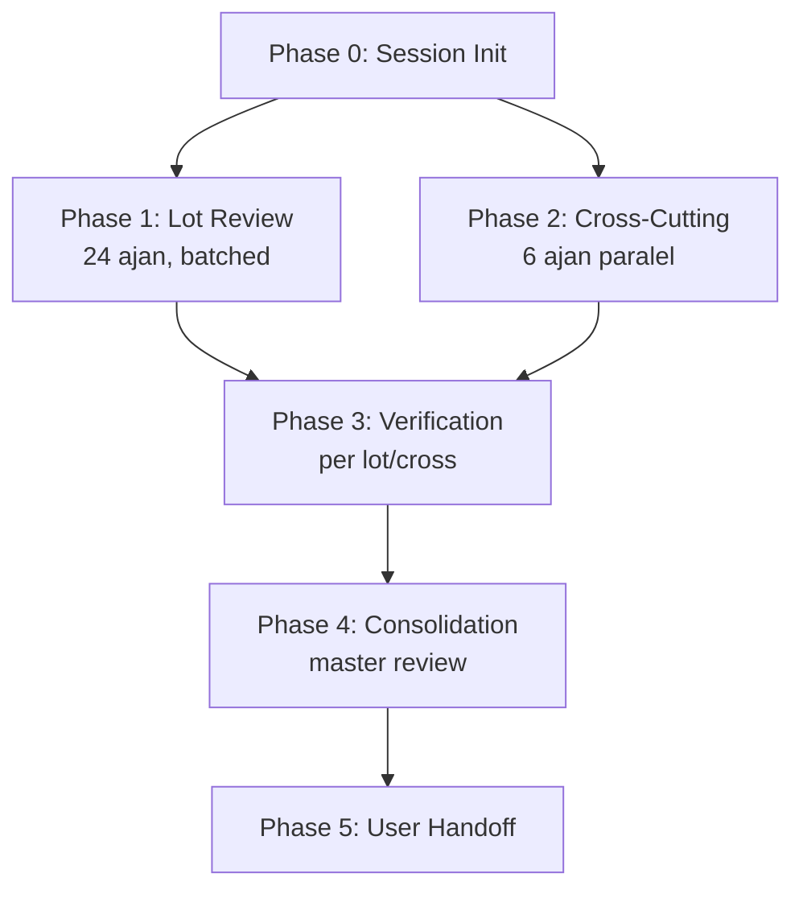

Tüm projeyi 4 fazlı çok-ajanlı review'den geçirir. Detaylı plan: [docs/code-reviews/master/MASTER-REVIEW-PLAN.md](../../../docs/code-reviews/master/MASTER-REVIEW-PLAN.md).

> **Bu skill bir launcher'dır** — ajanları dispatch eder, planı uygular, ilerlemeyi takip eder. Plan dosyası tüm detayları (lot tablosu, ajan brief'leri, çıktı şeması) içerir.

## Ne zaman kullanılır

✅ **Uygun:**
- Major release öncesi (örn. v1.0.0)
- Bir feature sprint'i tamamlandıktan sonra (3+ feature merge edildi)
- Mimari değişiklik sonrası (refactor PR'ı merge edildi)
- Yıllık/çeyreklik teknik borç audit'i
- KVKK/güvenlik denetimi öncesi

❌ **Uygun değil:**
- Tek PR'ı review etmek için → master-review yerine `claude-code-guide`'ın built-in [code-review](../../../.claude/agents/) skill'ini veya task-specific review prompt'u kullan
- Hızlı sanity check → [yasak-check](../yasak-check/SKILL.md) yeterli
- Sadece bir modülü review için → manuel agent dispatch

## Maliyet uyarısı

Master review **pahalı** bir operasyondur:
- 24 lot + 6 cross-cutting + N verification + 1 consolidation = ~30+ ajan
- 3-7 saat süre (paralel batch boyutuna bağlı)
- Yüksek token tüketimi (yüzbinlerce input/output)

Önce bu maliyetin ne işe yarayacağını netleştir.

## İş akışı (özet — detay plan'da)



## Adımlar

### 1. Plan'ı oku (zorunlu)

```bash
cat docs/code-reviews/master/MASTER-REVIEW-PLAN.md
```

Plan'ı **anlamadan ajan dispatch etme**. Lot tablosu, cross-cutting kapsamı, çıktı şeması, başlatma yönergeleri buradadır.

### 2. Session dizini oluştur

```bash
TS=$(date +%Y-%m-%dT%H-%M)
MODEL="claude-opus-4-7-1m"
SESSION_DIR="docs/code-reviews/master/${TS}-${MODEL}"

mkdir -p "${SESSION_DIR}/lots" "${SESSION_DIR}/cross-cutting" "${SESSION_DIR}/verification"
cp docs/code-reviews/master/MASTER-REVIEW-PLAN.md "${SESSION_DIR}/00-plan.md"
echo "📁 Session: ${SESSION_DIR}"
```

### 3. Phase 1 — Lot ajanlarını dispatch et

24 lot var (plan'ın 3. bölümü). Her ajan **bağımsız** olarak:
- Sadece kendi lot dosyalarını okur
- Tüm review lensleri üzerinden inceler
- Çıktıyı `lots/L{NN}-*.md` formatında yazar
- Kod düzenlemez

**Batch stratejisi:** 24 lot tek seferde paralel iyi değil — eşzamanlılık limitleri. 4-6'lı batch'lerde:

```
Batch 1: L01, L02, L03, L04, L05  (küçük lot'lar — hızlı bitsin)
Batch 2: L06, L07, L08, L09, L10
Batch 3: L11 (büyük what_if — tek başına), L12, L13
Batch 4: L14, L15, L16, L17
Batch 5: L18, L19, L20, L21
Batch 6: L22, L23, L24
```

Batch arası bekleme: önceki batch'in tamamı bitsin. **TodoWrite** ile her lot'un durumu takip edilir.

**Her ajana verilen brief** plan'ın 6. bölümünde — placeholder'ları doldurarak kullan.

### 4. Phase 2 — Cross-cutting ajanları

Phase 1 ile **paralel** ya da hemen sonrasında. 6 ajan:

- **X01 — Security & KVKK** (PII, secrets, KVKK Madde 11/12, auth)
- **X02 — Performance** (N+1, rebuild, leak, memory)
- **X03 — Documentation Consistency** (kod ↔ doc)
- **X04 — L10n Integrity** (TR/EN sync, unused, missing)
- **X05 — Test Coverage Gaps** (untested critical paths)
- **X06 — Architectural Consistency** (Clean Architecture genelinde)

Cross-cutting ajanları lot ajanlarından farklı: **örüntü** arar (en az 2 lokasyonda görülen).

### 5. Phase 3 — Verification

Her `lots/L*.md` ve `cross-cutting/X*.md` dosyası için **verifier ajanı**:
- Dosyadaki her finding'i sırayla doğrular
- Kodu açar, kontrol eder
- `✅ Confirmed` / `❓ Disputed` / `❌ Invalid` notu ekler
- Dosyanın frontmatter'ında `status: verified` yapar
- `verification/VERIFICATION-LOG.md`'a özet satır ekler

Verifier brief plan'ın 8. bölümünde.

### 6. Phase 4 — Consolidation

Tek consolidator ajanı:
- Tüm verified dosyaları okur
- `❌ Invalid` finding'leri atar
- Severity'ye göre önceliklendirir
- Tekrarlanan örüntüleri tespit eder
- `99-MASTER-REVIEW.md` üretir

Consolidator brief plan'ın 9. bölümünde.

### 7. Phase 5 — Handoff

Master raporu kullanıcıya teslim et:
- `99-MASTER-REVIEW.md` özet (2-3 paragraf yönetici özeti) terminal'e yaz
- En kritik 3 finding'i öne çıkar
- "Sonraki sprint için backlog candidate" tablosu

## TodoWrite kullanımı

Master review uzun sürer. **Her lot + her cross-cutting + verification + consolidation** ayrı todo. Şablon:

```
[ ] Phase 0 — Session init
[ ] L01 — features/account
[ ] L02 — features/comparison
... (24 lot)
[ ] X01 — Security & KVKK
... (6 cross-cutting)
[ ] Verification — all lots verified
[ ] Phase 4 — Consolidation
[ ] Phase 5 — Handoff özeti
```

Lot bittiğinde "completed", verifier başlayınca yeni todo eklenir.

## Kuralları

- **Hiçbir ajan kod düzenlemez** — sadece review dosyalarına yazar
- **Lot bağımsızlığı** — bir ajan kendi lot'u dışındaki dosyaları sadece bağlam için okur
- **Cross-cutting değer** — sadece örüntü (≥2 lokasyon)
- **Verifier yetkisi** — `❌ Invalid` işaretleyebilir ama gerekçesiz silemez
- **Duplicate** — aynı bulgu hem lot'ta hem cross-cutting'te ise, consolidator birleştirir
- **Model tutarlılığı** — bir session'da tüm ajanlar aynı model

## Çıktı

```
docs/code-reviews/master/{TS}-{MODEL}/
├── 00-plan.md                 # Snapshot
├── lots/
│   └── L01..L24-*.md          # Lot raporları (verified)
├── cross-cutting/
│   └── X01..X06-*.md          # Cross-cutting raporları (verified)
├── verification/
│   └── VERIFICATION-LOG.md    # Doğrulama özeti
└── 99-MASTER-REVIEW.md        # Konsolide rapor
```

**Tamamı `docs/code-reviews/` altında — `.gitignore`'da, repo'ya commit'lenmez.** Yerel referans.

## Yasak

- **Plan'ı atlayıp doğrudan ajan dispatch etmek** — MASTER-REVIEW-PLAN.md zorunlu prerequisite
- **Bir lot'u atlamak** — istisna yok, plan'da listelenen tüm lot'lar çalışır
- **Verification'sız konsolidasyon** — verifier görüşü olmadan master rapor üretmek finding kalitesini düşürür
- **Kod düzenlemek** — bu skill audit'tir, fix değil. Fix'ler ayrı geliştirme döngüsünde
- **Tek session'da farklı model kullanmak** — bulgular karşılaştırılabilir olmalı

## İlişkili

- [develop-task](../develop-task/SKILL.md) — günlük geliştirme disiplini (bu farklı bir kapsam)
- Built-in `code-review` skill — tek PR/diff için
- [yasak-check](../yasak-check/SKILL.md) — hızlı, lokal denetim
