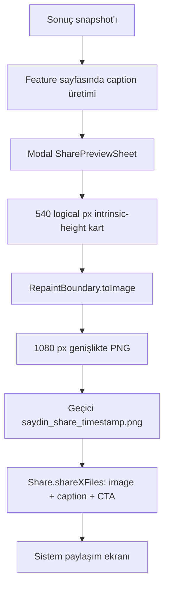

# Kapsam, envanter ve review yöntemi

## 1. İncelenen kullanıcı yüzeyleri

Ana uygulama beş sekmeyi `IndexedStack` içinde tutar: Hesapla, Karşılaştırma, Portföy, DCA ve Senaryolar (`lib/app.dart:430-473`). Paylaşım ayrı bir menü değildir; hesaplama sonucu üretildikten sonra Kaydet eyleminin yanında görünür.

| Menü / giriş | Paylaşım türü | Giriş kodu | Önizleme / kart |
|---|---|---|---|
| Hesapla — normal | “Ya alsaydım?” | `lib/features/what_if/presentation/pages/what_if_page.dart:295-314` | `ShareCardPreviewSheet` → `ShareCardWidget` |
| Hesapla — ters | “Ne kadar yatırmalıydım?” | `lib/features/what_if/presentation/pages/what_if_page.dart:272-294` | `ShareCardPreviewSheet` → `ReverseShareCardWidget` |
| Karşılaştırma | 2–5 varlık sıralaması | `lib/features/comparison/presentation/pages/comparison_page.dart:129-155,451-465` | `SharePreviewSheet` → `ComparisonShareCardWidget` |
| Portföy | Tam sonuç; partial sonuçta kapalı | `lib/features/portfolio/presentation/pages/portfolio_page.dart:155-176,477-490` | `SharePreviewSheet` → `PortfolioShareCardWidget` |
| DCA | Haftalık/aylık simülasyon | `lib/features/dca/presentation/pages/dca_page.dart:414-446` | `DcaShareCardPreviewSheet` → `DcaShareCardWidget` |
| Senaryolar | Doğrudan share yok; replay sonrası yukarıdaki akış | `lib/app.dart:265-373` | Sonuç türünün mevcut kartı |

Onboarding'deki share ikonu yalnız dekoratiftir (`lib/features/onboarding/presentation/pages/onboarding_page.dart:199-207`). Senaryo kartlarındaki `RepaintBoundary` kullanımları swipe arka planına aittir; paylaşım capture'ı değildir. Production kodunda ortak renderer dışında başka `toImage`, `toByteData` veya `shareXFiles` akışı bulunmadı.

## 2. Teknik zincir



Ortak zincirin kaynakları:

- Önizleme, loading ve hata UI'ı: `lib/core/widgets/share_preview_sheet.dart:23-147`
- Capture, PNG, temp dosya ve native share: `lib/core/utils/share_card_renderer.dart:38-106`
- Startup cleanup: `lib/core/utils/share_card_renderer.dart:108-162`
- Hesap silme cleanup'ı: `lib/features/account/data/repositories/account_data_repository_impl.dart:104-130`
- Caption ve CTA l10n kaynakları: `lib/l10n/app_tr.arb:285-309,373,393`; `lib/l10n/app_en.arb:285-309,373,393`
- Privacy açıklaması: `lib/features/legal/data/sources/privacy_policy_tr.dart:63-75`; İngilizce eşleniği `privacy_policy_en.dart:63-75`

## 3. Kart implementasyon envanteri

| Kart | Dosya | Boyut sözleşmesi | Başlıca içerik | Kalıcı test durumu |
|---|---|---|---|---|
| Normal What-if | `lib/features/what_if/presentation/widgets/share_card_widget.dart` | 540 × intrinsic | Varlık, tarih, initial/final, nominal getiri, koşullu inflation | Yalnız neutral metin smoke |
| Reverse What-if | `lib/features/what_if/presentation/widgets/reverse_share_card_widget.dart` | 540 × intrinsic | Required/target, nominal getiri, koşullu inflation | Yok |
| Comparison | `lib/features/comparison/presentation/widgets/comparison_share_card_widget.dart` | 540 × satır sayısı | 2–5 sıra, emoji rank, nominal yüzde | Yok |
| Portfolio | `lib/features/portfolio/presentation/widgets/portfolio_share_card_widget.dart` | 540 × içerik | İlk 6 kalem, +N, toplamlar, getiri, inflation | TR 320dp/200%, ellipsis, tarih ve tek golden |
| DCA | `lib/features/dca/presentation/widgets/dca_share_card_widget.dart` | 540 × içerik | Dönem, total/current, getiri, üç mini-stat, inflation | Yok |

Beş kart dosyası yaklaşık 1.859 satırdır. Aynı header, üst çizgi, değer çifti, outcome paneli, inflation bölümü ve footer ayrı ayrı kopyalanmıştır. İki ince adapter daha vardır:

- `lib/features/what_if/presentation/widgets/share_card_preview_sheet.dart`
- `lib/features/dca/presentation/widgets/dca_share_card_preview_sheet.dart`

## 4. Marka asset envanteri

Onaylı `01 / Zaman İzi` paketi `assets/branding/README.md:3-17` ile izlenebilir durumdadır.

| Asset | Boyut | Kullanım durumu |
|---|---:|---|
| `saydin-app-icon-ios-1024.png` | 1024² | Native iOS ikon kaynağı |
| `saydin-play-store-icon-512.png` | 512² | Play Store/native Android kaynağı |
| `saydin-symbol-on-light-1024.png` | 1024² | Native light yüzey kaynağı |
| `saydin-symbol-on-dark-1024.png` | 1024² | Native dark yüzey kaynağı |

Onaylı palette navy `#0B1D34`, teal `#2CB1B8`, off-white `#F5F6F7`'dir (`assets/branding/README.md:15`). Native ikon/splash zinciri bu kimliği uygular ve hash/boyut testleri vardır (`tool/tests/test_brand_assets.py:33-87`).

Runtime tarafında ise:

- `pubspec.yaml:64-66` altında marka asset veya font declaration'ı yoktur.
- `assets/branding/README.md:5-6`, master'ların runtime'a paketlenmediğini açıkça söyler.
- Kartlarda logo yerine `AppBranding.wordmark = 'saydın'` string'i (`lib/core/constants/app_branding.dart:10-14`) varsayılan sistem fontuyla çizilir.
- Kart aksanı ve wordmark rengi `AppColors.primary = #1565C0`'dır (`lib/core/constants/app_colors.dart:6`); native navy/teal kimlikten farklıdır.

Mevcut 1024² master'lar header'a doğrudan küçültülmemelidir: dosyalar square native safe-area/zemin kompozisyonu taşır. Runtime için Brand onaylı, kırpma ve safe-area'sı tanımlı sembol ile mümkünse kilitli horizontal wordmark türevi gerekir.

## 5. Test ve kanıt envanteri

| Alan | Mevcut kanıt | Açık |
|---|---|---|
| Renderer | `test/core/utils/share_card_renderer_test.dart:7-22` image dispose | Pixel dimensions, temp write/delete, cleanup, gateway sonuçları, iPad origin yok |
| Normal What-if | `test/features/what_if/presentation/widgets/result_card_test.dart:93-118` neutral artifact | Full golden, loss/profit, inflation, uzun veri yok |
| Portfolio | `portfolio_share_card_widget_test.dart:77-146` | EN, diğer outcome'lar, gerçek 1080 pipeline yok |
| Reverse | Yok | Tüm varyantlar |
| Comparison | Yok | 2/5 row, long name, inflation, emoji determinismi |
| DCA | Yok | Weekly/monthly, mini-stat overflow, inflation |
| Preview | Portföy içinde dolaylı | Caption görünürlüğü, focus, dismiss, error, retry yok |
| Native | Yok | iPad/Android/iOS gerçek cihaz share kontratı yok |

`test/coverage/all_production_libraries_test.dart` içindeki importlar davranış kanıtı değildir; test gövdesi yalnız production library'lerin derlenmesini sağlar.

## 6. Review yöntemi

Review beş eksende yürütüldü:

1. **Keşif:** `share`, `Share`, `RepaintBoundary`, `toImage`, `shareXFiles`, menü ve feature flag referanslarıyla production/test/docs tarandı.
2. **Akış izleme:** Her menüde sonuç state'inden caption, preview, capture, temp storage ve native share sonuna kadar veri takip edildi; Senaryolar replay dahil edildi.
3. **Görsel sistem:** Asset provenance, palette, type, spacing, hierarchy, density, outcome renkleri, fixed/intrinsic ölçü ve tek golden görseli incelendi.
4. **UX/a11y/platform:** Preview doğruluğu, kullanıcı iradesi, privacy, error recovery, text scale, contrast, semantics, focus, motion, iPad ve Android plugin davranışı değerlendirildi.
5. **Çapraz doğrulama:** Üç review hattının bulguları mevcut mimari/legal dokümanlar ve dependency kaynaklarıyla karşılaştırıldı; eski ve artık düzeltilmiş bulgular yeni sorun gibi raporlanmadı.

## 7. Doğrulama kayıtları

Başarıyla çalıştırılan komutlar:

```text
flutter analyze --fatal-infos <10 ilgili production dosyası>
→ No issues found

flutter test \
  test/core/utils/share_card_renderer_test.dart \
  test/features/portfolio/presentation/widgets/portfolio_share_card_widget_test.dart \
  test/features/what_if/presentation/widgets/result_card_test.dart
→ 10 test geçti
```

Bu doğrulama mevcut davranışın derlendiğini ve mevcut assertion'ları karşıladığını gösterir; aşağıdaki bulguların çoğu için assertion bulunmadığından onları geçersiz kılmaz.
