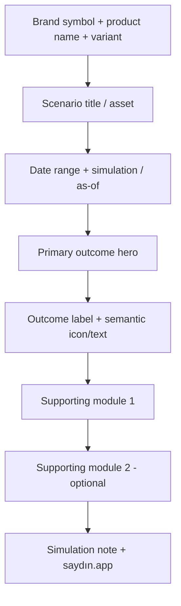

# Hedef paylaşım kartı tasarım sistemi

## 1. Tasarım hedefi

Yeni sistemin hedefi “daha çok dekor” değildir. Kart üç saniye içinde şu dört soruyu yanıtlamalıdır:

1. Bu hangi marka/ürün?
2. Hangi simülasyon yapıldı?
3. Tek ana sonuç nedir?
4. Sonucun tarihi ve varsayımı nedir?

Görsel dil; şık, minimal, finansal açıdan güven veren ve kaydırma akışında ayırt edici olmalıdır. Marka rengi sonucu değil markayı; semantic renk sonucu desteklemelidir. Kart bir ekran görüntüsü gibi değil, tasarlanmış bir paylaşım artifact'i gibi görünmelidir.

## 2. Onay gerektiren kararlar

Aşağıdakiler implementation başlamadan Product/Brand/Legal tarafından kilitlenmelidir:

| Karar | Review önerisi | Sahip |
|---|---|---|
| Canonical feed artboard | 1080×1350; Flutter 540×675 logical canvas → 2x export | Product + Design |
| Ek presetler | Square/story ancak kanıtlanan ihtiyaç varsa | Product |
| Marka işareti | Standalone “Zaman İzi” + kilitli horizontal wordmark | Brand |
| Runtime asset formatı | Şeffaf, optimize PNG/WebP seti veya approved SVG | Brand + Mobile |
| Font | Türkçe glyph + tabular numeral + lisans onaylı bundled sans | Brand + Legal |
| Disclaimer | Kısa simülasyon/approximation metni | Product + Legal |
| Default privacy | Tutarlar açık; kullanıcı tek dokunuşla gizleyebilir | Product + Privacy |
| CTA | Preview'da görünür ve kapatılabilir | Growth + Privacy |

Mevcut 1024² native master'lar runtime header'a doğrudan küçültülmemelidir. Kare zemin ve native safe-area kompozisyonu taşırlar. Runtime türevi onaylı export pipeline'ından gelmelidir.

## 3. Artboard ve grid

### Canonical preset

| Token | Logical | Export |
|---|---:|---:|
| `artboard.width` | 540 | 1080 px |
| `artboard.height` | 675 | 1350 px |
| `safe.horizontal` | 32 | 64 px |
| `safe.top` | 28 | 56 px |
| `safe.bottom` | 24 | 48 px |
| `grid.base` | 4 | 8 px |
| `section.gap` | 16 / 20 | 32 / 40 px |
| `panel.radius` | 16 | 32 px |
| `badge.radius` | 999 | pill |

Her variant aynı artboard içinde kalır. İçerik artboard'u büyütmez; detail projection özetlenir. Pixel ratio ve height birlikte sözleşmedir. PNG decode testinde exact `1080×1350` assert edilir.

### Safe-area ilkeleri

- Logo, hero metric ve domain safe-area dışına çıkmaz.
- Alt 64 export px yalnız trust/disclaimer/footer içindir.
- Variant content en fazla iki supporting module kullanır.
- Uzun veri projection katmanında kısaltılır; layout engine'e bırakılmaz.
- Background, crop halinde bile marka tanınabilirliğini koruyacak kadar sürekli olmalıdır; hayati metin kenarlara yakın değildir.

## 4. Marka tokenları

Onaylı pack'in bilinen renkleri tek kaynak olmalıdır:

| Rol | Başlangıç değeri | Kullanım |
|---|---|---|
| `brand.navy` | `#0B1D34` | Ana metin, güçlü zemin, logo light varyant zemini |
| `brand.teal` | `#2CB1B8` | Accent line/dot, badge shape, küçük dekoratif vurgu |
| `brand.offWhite` | `#F5F6F7` | Artboard ana yüzeyi |
| `surface.primary` | `#FFFFFF` | İç paneller |
| `text.primary` | Brand/contrast testinden geçen koyu navy | Ana içerik |
| `text.secondary` | En az 4.5:1 | Tarih, label, disclaimer |
| `semantic.profit` | Mevcut `#2E7D32` veya Design onaylı eşleniği | İkon + değer + metin |
| `semantic.loss` | Mevcut `#C62828` veya Design onaylı eşleniği | İkon + değer + metin |
| `semantic.neutral` | Mevcut `#455A64` veya Design onaylı eşleniği | İkon + değer + metin |

Teal, off-white üzerinde küçük normal text olarak kullanılmamalıdır; kontrastı rol bazında test edilmeden yalnız dekoratif/large-shape rolünde kalmalıdır. Kâr/zarar rengi markayı bastırmamalı; outcome hero'nun tamamını yeşil/kırmızı yüzeye çevirmek yerine ikon, chip ve değer aksanı olarak kullanılmalıdır.

## 5. Tipografi

Bundled font ile output deterministik hale gelmelidir. Önerilen logical scale:

| Token | Boyut | Weight | Rol |
|---|---:|---:|---|
| `display.hero` | 48–52 | 700 | Ana finansal sonuç |
| `title.card` | 24–28 | 700 | Varlık/winner/portfolio başlığı |
| `value.primary` | 18–20 | 650/700 | Ana para değeri |
| `body` | 15–16 | 400/500 | Supporting bilgi |
| `label` | 12–13 | 600 | Panel/metric label |
| `caption` | 12 | 400/500 | Tarih, as-of, disclaimer |

Gereksinimler:

- Türkçe `ı`, `İ`, `ğ`, `ş`, `ç`, `ö`, `ü` görsel QA.
- Tabular numerals veya finansal değerlerde eşit basamak ritmi.
- Yüksek ağırlıkta numeral/glyph kerning kontrolü.
- Lisans dosyası ve asset provenance.
- Platform fallback'e bırakılmayan weight mapping.

## 6. Ortak kart anatomisi



### `ShareCardFrame`

- Exact 540×675 logical canvas.
- Approved background treatment; light output ilk release için tek canonical variant olabilir.
- İçerik slotları: header, context, hero, modules, trust footer.
- Overflow assert'i debug/testte fail-fast.

### `BrandHeader`

- Gerçek runtime asset; `Text('saydın')` logo rolünde kullanılmaz.
- Sembol ve wordmark aynı lockup/safe-area sözleşmesini paylaşır.
- Sağda küçük variant badge: “Ya alsaydım?”, “Karşılaştırma”, “Portföy”, “Düzenli yatırım”.

### `ContextBlock`

- Title max 2 satır; bidi isolate.
- Tarih aralığı tek locale-aware component.
- Requested/actual farklıysa kısa “Fiyat tarihi: …” evidence chip'i.
- CPI kullanıldıysa “TÜFE verisi: … itibarıyla”.

### `OutcomeHero`

- Tüm varyantlarda aynı grid, ama metric semantiği variant'a göre değişebilir.
- Outcome icon + açık metin: “kazanç”, “zarar”, “değişim yok”.
- Yüzde veya para birimi 1 satır; `ResponsiveFinancialValue` ile scale-down ve min-size sınırı.
- Pozitif işaret, locale-aware yüzde ve tutar tek formatter projection'ından gelir.

### `SupportingModule`

Yalnız ürün sorusunu cevaplayan bilgi kalır. Maksimum iki module:

- `ValuePair`: başlangıç → son/hedef.
- `InflationSummary`: nominal / reel / cumulative; yalnız mevcut alanlar.
- `RankList`: winner + en fazla ilk 3; emoji yok.
- `PortfolioSummary`: top allocation/value items + “+N diğer”.
- `DcaSummary`: toplam yatırım, alım sayısı, dönemsel tutar.

### `TrustFooter`

- “Simülasyon · yaklaşık değerler” gibi Legal onaylı kısa nitelik.
- `saydın.app`.
- İstenirse calculation date/version; kullanıcı finansal tutarı gizlese de marka/trust kalır.
- 12 logical px altına inmez ve 4.5:1 kontrast sağlar.

## 7. Variant reçeteleri

### 7.1 Normal What-if

**Ana mesaj:** “Başlangıç tutarı bugün/şu tarihte ne olurdu?”

Önerilen sıra:

1. Bitcoin + tarih/context.
2. Hero: final value; yanında/below getiri badge.
3. Compact `₺10.000 → ₺28.470` value pair.
4. Inflation açıksa tek compact nominal/reel module.

Mevcut karttaki büyük return paneli korunabilir, ancak final value ana kullanıcı sorusunu daha doğrudan cevapladığı için hero metric Product A/B kararıyla kilitlenmelidir.

### 7.2 Reverse What-if

**Ana mesaj:** “Hedefe ulaşmak için ne kadar yatırmalıydım?”

1. Asset + target context.
2. Hero: “Gereken yatırım ₺51.136”.
3. Hedef değer + nominal return supporting row.
4. Inflation özeti varsa secondary.

Normal What-if'in kopyası olmamalı; ters sorunun cevabı hero olmalıdır.

### 7.3 Comparison

**Ana mesaj:** “Hangi varlık önde?”

1. Hero: winner adı ve outcome.
2. Numeric branded rank badge: 1, 2, 3; platform emoji yok.
3. En fazla ilk üç satır; 4–5 varsa “+N diğer”.
4. Inflation açıksa ranking mode açıkça “Nominal” veya “Reel” olarak etiketlenir; ikisi karıştırılmaz.

Winner paneli brand navy/off-white ile ayrılır; kâr rengi yalnız outcome değerinde kullanılır.

### 7.4 Portfolio

**Ana mesaj:** “Portföyün toplam sonucu ne?”

1. Hero toplam getiri/final değer en üstte; item listesi önüne geçmez.
2. Total investment → final value.
3. En fazla ilk üç varlık + “+N diğer”; satırların anlamı “başlangıç tutarı” veya “pay” etiketiyle açık olur.
4. Inflation tek compact module.

Mevcut ilk altı item yoğunluğu azaltılmalıdır. Sosyal artifact ayrıntılı ekstre değil, özet ve davet yüzeyidir.

### 7.5 DCA

**Ana mesaj:** “Düzenli yatırımın sonucu ne?”

1. Hero final value/getiri.
2. `₺2.500 / ay · 68 alım` context chip.
3. Total invested → current value.
4. Average cost yalnız detail modu açıkken; üç kolon 10 px mini-stat kaldırılır.

Caption ve card açıkça simülasyon der; “N alım yaptım” gerçek işlem iddiası kullanılmaz.

## 8. Privacy ve kişiselleştirme durumları

Kart editörü tam serbest tasarım aracı olmamalıdır. Kontrollü, hızlı seçenekler:

| Seçenek | Varsayılan | Etki |
|---|---|---|
| Tutarları göster | Açık | Kapatılırsa TL değerleri “Gizli”, yüzdeler kalır |
| Varlık adlarını göster | Açık | Portföyde dağılım gizlenebilir |
| Inflation özeti | Hesaba göre | Kullanıcı kapatabilir; caption parity korunur |
| Caption | Önizlenir | Düzenlenebilir, resetlenebilir |
| İndirme CTA | Açık ama görünür | Kullanıcı kapatabilir |
| Theme | İlk release canonical light | Dark ancak tam token/golden matrisi varsa |

Her seçenek `SharePayload`ı yeniden üretir; preview ve final native çağrı aynı payload hash'ini kullanır.

## 9. Hedef kod mimarisi

```dart
final class SharePayload {
  final ShareCardViewModel card;
  final String caption;
  final SharePrivacyOptions privacy;
  final ShareOutputPreset preset;
  final String locale;
}

sealed class ShareCardViewModel {
  final BrandHeaderModel header;
  final ContextModel context;
  final OutcomeModel hero;
  final List<ShareModuleModel> modules;
  final TrustFooterModel footer;
}
```

Önerilen sorumluluk sınırları:

| Katman | Sorumluluk |
|---|---|
| Feature projection | Domain snapshot → typed card/caption data; finansal parity |
| `SharePolicy` | Feature flag, partial result, privacy/entitlement |
| `ShareCardFrame` | Deterministik layout ve brand tokens |
| `ShareRenderer` | Exact pixel PNG; render-only |
| `ShareGateway` | Native share/copy/save capability ve platform sonuçları |
| `ShareCoordinator` | Preview, cancel, busy, retry, typed errors |
| Tests | Projection, artboard, semantics, platform contract |

Renderer l10n veya caption eklememelidir. Bugünkü gizli `+ shareCta` davranışı kaldırılmalı; final payload preview açılmadan önce tamamen oluşmalıdır.

## 10. Görsel Definition of Done

- Gerçek, approved logo/wordmark runtime asset olarak görünür.
- Native ikon/splash ve kart aynı navy/teal/off-white kimliği taşır.
- Bütün kartlar exact artboard ve aynı safe-area/grid'i kullanır.
- Ana sonuç ilk bakışta görünür; en fazla iki supporting module vardır.
- 320 dp preview'da zoom ve erişilebilir metinsel özet bulunur.
- Small text kontrastı ≥4.5:1; bilgi yalnız renkle aktarılmaz.
- Uzun TR/EN/pseudo-l10n ve ekstrem finansal değerlerde clip/overflow yoktur.
- Font, logo ve rank badge platformdan bağımsız deterministiktir.
- Preview'da görülen image/caption/options final payload ile byte/semantic parity taşır.
