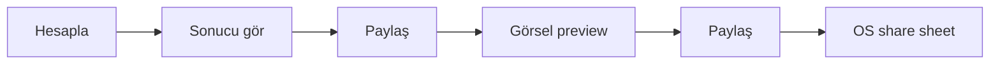
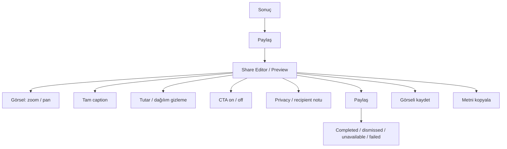
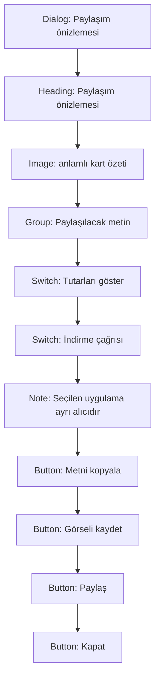

# UX, erişilebilirlik, platform ve QA sözleşmesi

## 1. Mevcut journey değerlendirmesi

Mevcut iki adımlı journey doğru bir temeldir:



Güçlü tarafı yanlışlıkla doğrudan paylaşımı engellemesidir. Zayıf tarafı, ikinci adımın “final payload preview” değil yalnız “kart görüntüsü preview” olmasıdır. Caption, CTA, recipient açıklaması ve privacy seçenekleri bu journey'nin dışındadır.

## 2. Hedef journey



### Journey ilkeleri

1. Preview açılınca henüz dosya yazılmaz.
2. Kullanıcı final image ve caption'ı aynı ekranda görür.
3. Preview kapatılırsa pending render/native share iptal edilir.
4. Tek tap tek render ve tek gateway çağrısı üretir.
5. Dismissed, success olarak raporlanmaz.
6. Platform share yoksa copy/save fallback'i vardır.
7. Telemetri kullanıcı feedback'ini geciktirmez veya engellemez.
8. Share kapalıysa UI, preview, file write ve gateway katmanlarının tamamı fail-closed davranır.

## 3. Share state machine

| State | Kullanıcı UI'ı | İzin verilen eylem |
|---|---|---|
| `editing` | Image + caption + options | Update, close, share/copy/save |
| `rendering` | Açık busy label + cancel | Cancel; duplicate action yok |
| `ready` | Rendered payload hash/dimensions | Gateway'e dağıt |
| `presentingNative` | Native sheet aktif | App route state korunur |
| `dismissed` | Preview'a dön | Edit/retry/close |
| `completed` | Doğrulanabilen platform sonucu | Close; “gönderildi” iddiası yalnız platform destekliyorsa |
| `failed` | Typed error + recovery actions | Retry/copy/save/close |
| `cancelled` | Native çağrı yok | Route kapanabilir |

Her async geçiş generation/cancel token kontrolü yapmalıdır. `mounted` yalnız setState güvenliği sağlar; kullanıcı iradesi/cancel sözleşmesi değildir.

## 4. Hata ve recovery modeli

| Typed hata | Kullanıcı mesajı | Birincil recovery | Teknik davranış |
|---|---|---|---|
| `renderFailed` | Görsel hazırlanamadı | Tekrar dene / Metni kopyala | Boundary/encode telemetry |
| `storageUnavailable` | Görsel geçici olarak kaydedilemedi | Tekrar dene / Metni kopyala | Disk/path error, finansal veri loglama yok |
| `shareUnavailable` | Bu cihazda paylaşım hedefi bulunamadı | Kaydet / Metni kopyala | `ShareResult.unavailable` |
| `permissionDenied` | Görsel kaydetme izni verilmedi | Ayarlar / Paylaş | Yalnız explicit save yolunda |
| `platformFailed` | Sistem paylaşımı açılamadı | Tekrar dene / Kaydet / Kopyala | Platform exception |
| `cancelled` | Mesaj gerekmez | — | Native çağrı yapılmaz |

Kurallar:

- Snackbar/dialog içeriği `Semantics(liveRegion:true)` ile duyurulur.
- Hata UI'ı Sentry `await`inden önce görünür; telemetry best-effort'tur.
- ErrorReporter'a asset, tutar, tarih veya caption gönderilmez.
- Retry idempotent'tır; çift invocation üretmez.

## 5. Erişilebilirlik sözleşmesi

### 5.1 Görsel preview ve text resize

Capture artifact'i exact tasarım için sabit type scale kullanabilir. Kullanıcının karar verdiği preview UI'ı kullanamaz.

Zorunlu davranış:

- Görsel `InteractiveViewer` ile en az 1×–4× zoom/pan.
- Altında sistem text scale ile akan erişilebilir özet.
- %200 ve %300 text scale'de sheet CTA'ları ve summary görünür/scroll edilebilir.
- Bold Text/Font Weight ayarlarıyla layout testi.
- Screen reader için görseldeki onlarca raw text yerine tek anlamlı summary veya mantıklı section listesi.

### 5.2 Semantics

Önerilen ağaç:



- Başlık `header:true`.
- Busy state `liveRegion` ve button disabled/busy state ile okunur.
- Outcome “+%10 yeşil” değil “yüzde 10 kazanç” şeklinde label taşır.
- Dekoratif logo/shape duplicate semantics üretmez.
- Caption edit field label, hint, character/line policy ile sunulur.

### 5.3 Focus ve klavye

- Sheet açılınca heading veya ilk meaningful control focus alır.
- Focus sheet içinde mantıklı sırada kalır.
- Escape/back: rendering değilse close; rendering ise explicit cancel davranışı.
- Kapanınca focus kaynak Paylaş butonuna döner.
- Space/Enter primary action; platform uygunsa Cmd/Ctrl+C caption copy.
- Focus indicator WCAG görünürlük hedefini karşılar.
- Screen reader swipe sırası görsel sıra ile aynıdır.

### 5.4 Motion

- `MediaQuery.disableAnimations` true ise modal/content transitions azaltılır; scroll-to-result `jumpTo` veya sıfır süreli olur.
- Spinner dışında zorunlu motion yoktur; busy metni hareket olmadan da state'i anlatır.
- Animation hiçbir state transition'ın tek göstergesi değildir.

### 5.5 Contrast ve target

- Normal küçük metin ≥4.5:1.
- Large text/icon ≥3:1.
- Interactive control ve focus outline ≥3:1.
- Tüm primary/secondary eylemler en az 48×48 logical touch target.
- Semantic profit/loss/neutral renk yanında ikon/metin zorunlu.

## 6. Privacy ve veri yaşam döngüsü

### Preview

- Final caption eksiksiz görünür.
- “Seçtiğiniz mesajlaşma/sosyal/dosya uygulaması ayrı alıcıdır” kısa notu görünür.
- Kullanıcı tutarları ve portföy dağılımını paylaşmadan önce gizleyebilir.
- Clipboard yalnız explicit “Metni kopyala” ile yazılır; otomatik copy yoktur.

### Temp storage

- Rendered kaynak ve plugin-owned kopya ayrı asset lifecycle'larıdır.
- Dosya adları finansal data taşımaz; timestamp/opaque ID yeterlidir.
- Canonical target doğrulanmadan recursive cleanup yapılmaz.
- Startup, lifecycle resume, account wipe ve share completion fault-injection testleri vardır.
- Delete hataları finansal içeriği loglamadan teknik telemetry üretir ve hesap silme akışında partial failure olarak raporlanır.
- Legal metin “1 saatte otomatik silinir” gibi uygulamanın garanti edemediği iddiayı kullanmaz; ölçülen “share completion/next launch/OS cache lifecycle” davranışını dürüstçe açıklar.

## 7. Platform sözleşmesi

### iOS / iPadOS

- `sharePositionOrigin` CTA'nın global rect'inden gelir.
- iPad portrait/landscape/Split View için finite non-empty anchor.
- Native sheet TR/EN app language × OS language matrisi.
- Share to Messages, Mail, Files ve Photos/Save action davranışı.
- Photo Library add permission yalnız explicit save veya sistem action gerçekten bunu gerektirirse istenir; denial recoverable'dır.
- Background/foreground ve preview route dismiss yarışları test edilir.

### Android

- `share_plus` nested cache kopyası lifecycle'ı doğrulanır.
- Android 13+ permission davranışı; explicit image save varsa scoped storage sözleşmesi.
- Messages/WhatsApp/Gmail/Files hedeflerinde image-only, text-only ve image+text uyumluluğu.
- Share target yok, chooser dismissed, app backgrounded, activity unavailable durumları.
- Account wipe plugin cache'i de güvenli biçimde temizler.

### Mobile-only sınırı

Mevcut repository'de web/desktop target yoktur ve renderer `dart:io` kullanır. Bu review mobile-only sözleşmeye göre yazılmıştır. Gelecekte web/desktop istenirse aynı `ShareGateway` capability modeli download/clipboard/web share API'ye ayrı adapter ile genişlemelidir; mobile koduna condition ekleyerek yayılmamalıdır.

## 8. Kapsamlı QA matrisi

| Boyut | Varyantlar | Zorunlu assertion / artifact |
|---|---|---|
| Journey | What-if, Reverse, Comparison 2/5, Portfolio 1/6/20, DCA weekly/monthly | Result = preview = PNG = caption; doğru focus ve policy |
| Entry | Direct + dört Scenario replay türü | Aynı kart/policy; stale result paylaşılmaz |
| Outcome | Profit, exact zero/neutral, loss | Renk+ikon+metin; sign ve locale doğru |
| Inflation | off, both, only real, only cumulative, stale/as-of | Null→0 yok; label/caveat parity |
| Dates | Explicit end, open-ended, actual buy/sell adjustment, holiday | Requested/effective/as-of doğru ve anlaşılır |
| Portfolio | Complete, partial, 1/6/20 item | Partial fail-closed; summary doğru |
| Policy | `share=true/false`, config loading/fallback, preview açıkken flag değişimi | false iken UI/file/gateway invocation sıfır |
| Privacy | Amount show/hide, distribution show/hide, caption edited, CTA off | Preview/final payload hash parity |
| Locale | TR, EN, pseudo-l10n +50%, bidi asset adı | No clip/overflow; grammar/date/currency doğru |
| Values | Min/max tutar, büyük yüzde, negative, zero, unbreakable text | Finite/range guard; min type size korunur |
| Viewport | 320×568, 360×640, 430×932, landscape | Preview scroll/zoom; CTA erişilebilir |
| Tablet | iPad portrait/landscape/Split View | Origin rect; crash/hang yok |
| A11y | 100/200/300% text, bold, contrast, light/dark app shell | Summary okunur; AA; 48dp |
| AT | VoiceOver, TalkBack, Switch Control, hardware keyboard | Role/name/state/order/focus restore/live region |
| Motion | Normal + Reduce Motion | Aynı bilgi; forced animation yok |
| Native result | success, dismissed, unavailable, no target, exception | Typed doğru UI; idempotent retry |
| Rendering | boundary null, encode null/throw, exact 1080×1350, huge content | Typed error veya valid PNG; no silent bad artifact |
| Storage | temp unavailable, disk full, delete failure | Recovery; no PII log; cleanup marker doğru |
| Lifecycle | force-quit, background, restart <1h/>1h, >20 files | Root + plugin cache retention doğru |
| Account wipe | Root PNG, plugin nested cache, unrelated files | Yalnız exact targets silinir; partial failure dürüst |
| Target apps | Messages, WhatsApp, Mail/Gmail, Files, Photos | Image/text compatibility ve readable crop |

## 9. Golden matrisi

Minimum merge gate:

- 5 variant × TR/EN.
- Profit/neutral/loss için en az hero component goldens.
- Inflation off/both/partial states.
- Long-content ve extreme-value fixture.
- Exact canonical artboard.
- Approved font ve runtime logo dahil.

Her kombinasyonu körlemesine ayrı snapshot'a çevirmek yerine component goldens + representative full-card matrix kullanılabilir. Ancak her variant en az bir full-card TR ve EN golden'a sahip olmalıdır.

Önerilen dosya adlandırması:

```text
share_<variant>_<locale>_<outcome>_<inflation>_<privacy>_1080x1350.png
```

## 10. Native release smoke checklist

- [ ] iPhone current-1/current OS, TR/EN
- [ ] iPad portrait/landscape/Split View; origin doğrulandı
- [ ] Pixel ve Samsung sınıfı Android cihaz
- [ ] App dark/light shell içinde canonical kart preview
- [ ] Image + caption target compatibility
- [ ] Dismiss, retry, background, force-quit
- [ ] Root temp + Android plugin cache inspection
- [ ] Account deletion sonrası artifact kalmadı
- [ ] VoiceOver/TalkBack journey kaydı
- [ ] Release artifact ve screenshot kanıtı saklandı

Statik/widget testleri bu checklist'in yerine geçmez. Native share ve plugin cache iddiaları gerçek cihaz kanıtı olmadan “doğrulandı” sayılmamalıdır.
