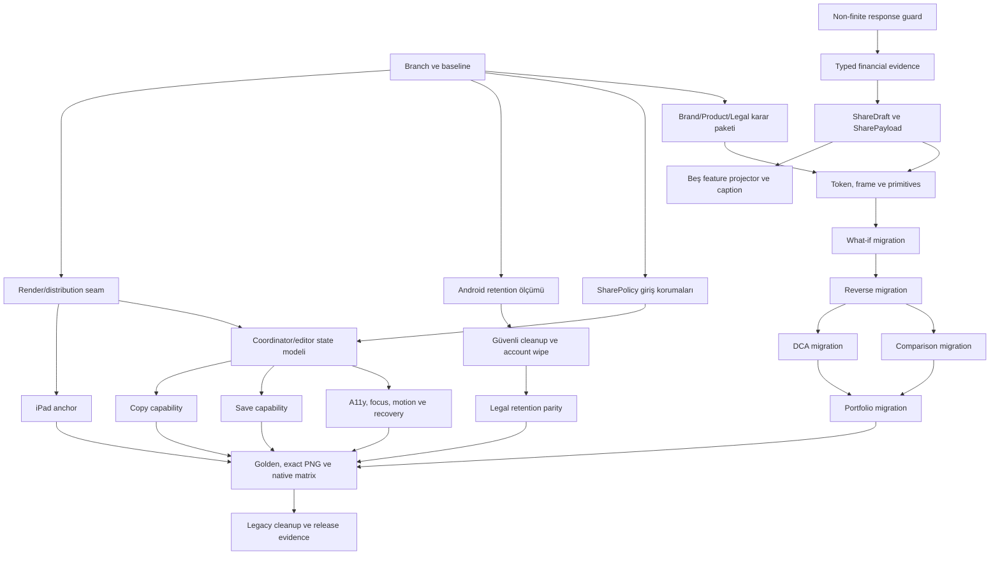

# Paylaşım kartları — uygulama aksiyon planı

**Başlangıç:** 19 Ağustos 2026

**Branch:** `development`

**Branch doğrulaması:** `main...development = 0/5`; development main'in tamamını içeriyor ve beş commit ileride

**Kapsam:** `02-findings.md` içindeki CARD-001–CARD-018 bulgularının tamamı

## 1. Yürütme ilkeleri

1. Sıra severity kadar dependency'ye de uyar: ortak platform ve veri sözleşmesi çözülmeden görsel migration yapılmaz.
2. Aynı dosya kümesine aynı anda iki agent dokunmaz.
3. Her dalga kendi test kapısını geçmeden sonraki dalga ortak dosyalara başlamaz.
4. Brand/Legal gibi irreversible kararlar approved kaynak olmadan uydurulmaz; güvenli engineering varsayımları decision log'a yazılır.
5. Mevcut kullanıcı değişiklikleri korunur; branch değiştirilmez, reset/rebase yapılmaz.
6. Native runtime iddiası simulator/widget testinden türetilmez; gerçek-device açıkları release checklist'te açık kalır.

### Bağımlılık grafiği



## 2. Durum göstergesi

| Durum | Anlam |
|---|---|
| `TODO` | Başlanmadı |
| `ACTIVE` | Dosya sahipliği atanmış, uygulama sürüyor |
| `VERIFY` | Kod tamam, çapraz review/test bekliyor |
| `BLOCKED` | Dış karar veya gerçek cihaz olmadan kapanamaz |
| `DONE` | Kod + test + doküman kabul kriterleri sağlandı |

## 3. Dalga planı

### W0 — P0 release güvenliği

| İş | Finding | Durum | Dosya sahipliği | Çıkış kapısı |
|---|---|---|---|---|
| iPad popover anchor | CARD-002 | `VERIFY` | core renderer/preview + renderer tests | Finite/non-empty rect unit/widget testi; gerçek iPad smoke release checklist |
| Android plugin cache lifecycle | CARD-001 | `VERIFY` | renderer cleanup, account wipe, legal/test | Exact nested path fixture; unrelated path korunur; account wipe partial failure; gerçek cihaz retention `BLOCKED` kanıtı |

W0 ile eşzamanlı yalnız görsel/core dosyaya dokunmayan policy işi yürüyebilir.

### W1 — P1 policy ve immutable payload

| İş | Finding | Durum | Bağımlılık | Çıkış kapısı |
|---|---|---|---|---|
| Ortak share feature policy | CARD-007 | `DONE` | Yok | Yalnız ready+true; 5 direct/replay ve preview-open flag değişiminde UI→file→gateway invocation sıfır |
| Non-finite parser/display guard | CARD-011 | `DONE` | Yok | NaN/±Infinity reddedilir; finite büyük değer ve sıfır kabul edilir |
| `SharePayload` contract | CARD-004/006 | `DONE` | W0 merge/verify | Variant projection'dan türetilir; 1080×1350 preset, caption ve erişilebilir özet invariant'ları testli |
| Typed inflation/date/as-of projection | CARD-008 | `DONE` | Finite guard | Partial alan kaybı/null→0 yok; mixed/range coverage açık |
| TR/EN simülasyon caption'ı | CARD-014 | `TODO` | Payload + Product-safe copy | Explicit/open-ended tarih testleri |
| Privacy options modeli | CARD-006 | `DONE` | Payload | Amount/distribution/CTA toggle deterministik; eski caption/summary privacy değişiminde taşınamaz |

### W2 — P1 brand ve ortak artboard sistemi

| İş | Finding | Durum | Bağımlılık | Çıkış kapısı |
|---|---|---|---|---|
| Runtime standalone symbol/wordmark asset'i | CARD-003 | `DONE` | Production Asset Pack | Şeffaf horizontal light/dark lockup + symbol; checksum, pubspec ve render testi |
| Brand/share color tokens | CARD-003/010 | `DONE` | Asset kararı | Resmî navy/teal/off-white; small text tüm light yüzeylerde ≥4.5:1 otomatik test |
| Bundled deterministic font | CARD-016 | `DONE` | Inter 4.1 / SIL OFL 1.1 | 400/500/600/700 static font, checksum, license ve tabular numeral sözleşmesi |
| Exact `ShareCardFrame` | CARD-004/005 | `TODO` | Payload | 540×675 logical → 1080×1350 PNG |
| Ortak primitives | CARD-004/011 | `ACTIVE` | Frame/tokens | `ShareCardSurface` ve gerçek asset header tamam; hero, value pair, inflation, footer, responsive value açık |

İlk review anındaki dört repo master'ı kare ve opak native/store kompozisyonuydu; bu nedenle bunlardan yeni logo türetilmedi. Daha sonra sağlanan Saydın Production Asset Pack içindeki şeffaf horizontal light/dark lockup ve full-color symbol checksum ile doğrulanarak doğrudan runtime'a alındı. Header artık `Text("saydın")` çizmez; onaylı horizontal asset'i tek ortak primitive üzerinden kullanır.

### W3 — P1 variant migration

| Sıra | Variant | Finding | Durum | Özel kabul |
|---:|---|---|---|---|
| 1 | What-if | CARD-003–011 | `TODO` | Final value/return hiyerarşisi, date/as-of parity |
| 2 | Reverse | CARD-003–011 | `TODO` | Required investment hero; normal kart kopyası değil |
| 3 | DCA | CARD-008/011/014 | `TODO` | 10px mini-stat yok; partial inflation; simülasyon dili |
| 4 | Comparison | CARD-008/011/016 | `TODO` | Emoji yok; nominal/reel mode açık |
| 5 | Portfolio | CARD-005/008/011 | `TODO` | Hero önce; top-N summary; partial fail-closed |

Her variant migration'ı aynı shared primitives'e dayanır; birbirinden bağımsız feature dosyaları core API stabilize olduktan sonra sınırlı paralel yürütülebilir.

### W4 — P1/P2 preview, a11y ve recovery

| İş | Finding | Durum | Bağımlılık | Çıkış kapısı |
|---|---|---|---|---|
| Final caption/CTA preview | CARD-006 | `DONE` | Payload | Görünen frozen caption native gateway'e byte-for-byte gider; CTA gizlice eklenmez |
| Zoom + responsive summary | CARD-009 | `DONE` | New frame | 1–4× zoom/pan; 320×568 ve %300 text scale kabul testi |
| Cancel-aware coordinator | CARD-012 | `DONE` | Gateway | Route kapandıktan sonra pre-gateway authorization false; native call yok |
| Typed errors + Retry/Copy | CARD-013 | `VERIFY` | Gateway/capability | Typed delivery + explicit exact-caption copy tamam; granular render/storage recovery matrisi açık |
| Platform save capability | CARD-013 | `BLOCKED` | Product/privacy izin kapsamı + storage adapter | iOS add-only Photos, Android scoped MediaStore ve gerçek cihaz smoke |
| Semantics/focus/motion | CARD-015 | `VERIFY` | New preview | Otomatik semantics/focus/keyboard/reduced-motion testleri geçti; VoiceOver/TalkBack cihaz kanıtı açık |

Save-image capability platform izin/retention yüzeyini genişletir. İlk güvenli fallback `Metni kopyala`dır. Direct “Görseli kaydet” yalnız iOS/Android storage adapter ve permission testleri aynı dalgada sağlanabiliyorsa açılır. Copy-only CARD-013'ü tamamen kapatmaz; save capability veya kapsamı değiştiren açık Product kararı olmadan finding `DONE` olmaz.

### W5 — P2/P3 kalite ve cleanup

| İş | Finding | Durum | Çıkış kapısı |
|---|---|---|---|
| Beş variant TR/EN goldens | CARD-016 | `ACTIVE` | Portfolio macOS/Linux brand golden tamam; kalan variant/locale/state matrisi açık |
| Renderer/storage/native contract tests | CARD-001/002/013 | `VERIFY` | Unit/widget origin, cleanup ve delivery testli; pixel/device matrisi açık |
| Policy direct/replay matrix | CARD-007 | `DONE` | loading/fallback/false durumda entry veya gateway invocation yok |
| Projection edge cases | CARD-008/011/014 | `ACTIVE` | partial inflation/date/rank testli; caption, long/extreme/bidi entegrasyonu açık |
| Preview semantics/focus tests | CARD-009/015 | `DONE` | SemanticsTester + %300 text scale + keyboard + reduced motion testli |
| Adapter invariant cleanup | CARD-017 | `VERIFY` | What-if exactly-one named constructor tamam; ince DCA wrapper temizliği açık |
| iOS localization verification | CARD-018 | `BLOCKED` | App×OS TR/EN gerçek cihaz matrisi; key yalnız kanıtla |

## 4. Paralel çalışma sınırları

| Hat | Yazabileceği alan | Aynı anda dokunamayacağı alan |
|---|---|---|
| Platform/privacy | renderer, preview anchor, account wipe, legal, ilgili tests | Visual card widgets, feature pages |
| Policy | feature pages, policy helper, policy tests | Renderer/preview, card widgets |
| Payload/projection | new share models, l10n/projections | Preview ve visual widgets core API kilitlenene kadar |
| Visual system | share tokens/components/assets | Feature migration başlamadan önce API stabilize edilmeli |
| Variant migration | Kendi feature widget/tests | Başka variant dosyası; shared core yalnız root onayıyla |
| Preview/a11y | common preview/coordinator/tests | Platform agent tamamlanmadan başlanmaz |

## 5. Karar günlüğü

| Karar | Gerekçe | Risk/geri dönüş |
|---|---|---|
| `development` branch'te kal | Branch main'i tamamen içeriyor; kullanıcı talebi | Reset/rebase yok |
| Canonical artboard 1080×1350 | Review'daki tek, test edilebilir iç standart | Preset enum ile square/story sonra eklenebilir |
| İlk review'da kare master'ı standalone logo saymama | Master'lar opak native/store kompozisyonuydu; header kullanım onayı yoktu | Sonraki Production Asset Pack kararıyla şeffaf horizontal lockup kullanılarak supersede edildi |
| Production Asset Pack horizontal lockup'ını runtime marka imzası olarak kullan | Paket şeffaf light/dark horizontal lockup, symbol, manifest ve QA kanıtı sağlıyor | Dosyalar checksum ile pinlendi; kart capture öncesi asset decode zorunlu |
| Kart/export fontu olarak Inter 4.1 seç | Açık kaynak SIL OFL 1.1, Türkçe glyph kapsamı, tabular numeral ve static weight exportları | Sürüm/weight/hash/lisans repoda sabit; font değişimi yeni golden gerektirir |
| Canonical share output ilk etapta light | Mevcut kartlar light; dark matrix karar/yük getirir | Theme preset API genişletilebilir |
| Caption/CTA preview öncesi oluşturulur | Kullanıcı iradesi ve payload parity | Renderer business/l10n'den arındırılır |
| Copy fallback save'den önce | Clipboard explicit ve daha dar permission yüzeyi | Save capability ayrı adapter ile eklenir |
| Null financial metric asla sıfıra coerce edilmez | Veri doğruluğu | UI “veri yok”/module omission gösterir |
| Emoji rank kaldırılır | Deterministik, kurumsal görünüm | Numeric branded badge kullanılır |
| Share policy yalnız `ready && share` iken açık | Loading/fallback sırasında remote kill-switch güvenilir değildir | Gerekirse ayrıca kalıcı, imzalı last-known-ready config tasarlanır |

## 6. Dalga bazlı kalite kapıları

Her dalga sonunda:

```text
dart format --output=none --set-exit-if-changed <changed dart files>
flutter analyze --fatal-infos
flutter test <targeted tests>
python3 -m unittest tool.tests.test_brand_assets   # asset dalgasında
git diff --check
```

Final kapı:

- Tüm tracked Flutter test suite.
- Repository kalite sözleşmeleri.
- TR/EN ARB contract.
- Beş variant exact-size golden matrix.
- iOS/iPadOS/Android release smoke açık/kapalı kanıt listesi.

## 7. Tamamlanma ölçütü

Bu plan yalnız kod yazıldığında değil, `05-remediation-roadmap.md` Definition of Done listesindeki tüm maddeler kod/test/device-evidence veya açık dış blokaj statüsüyle kapatıldığında tamamlanır. Dış gerçek-cihaz/brand-font kararı gerektiren madde sessizce “done” yapılmaz.

## 8. Uygulama kanıt günlüğü

### 19 Ağustos 2026 — W0/W1 ilk doğrulama

- Android cache, renderer/origin, preview authorization, account wipe ve share policy için ortak hedefli koşu: 38 test geçti.
- C1 finite-value validator, What-if/Reverse/DCA/Comparison parser ve Portfolio aggregation koşusu: 71 test geçti.
- W0/policy kapsamındaki 12 production dosyası `flutter analyze --fatal-infos`: temiz.
- C1 kapsamındaki 6 production dosyası `flutter analyze --fatal-infos`: temiz.
- Renderer/preview final-caption ve typed-delivery koşusu: 16 test geçti; 4 production dosyası analizde temiz.
- C2 typed financial evidence ve beş feature projector doğrulaması: 13 odak test geçti; 9 production dosyası analizde temiz. Agent'ın geniş C2 koşusunda 33 test ve full analyze da geçti.
- Gerçek Android retention ve iPad portrait/landscape/Split View kanıtı henüz yoktur; CARD-001/002 bu nedenle `DONE` değildir.
- Policy UI açılışında, render başlangıcında ve native gateway'den hemen önce canlı doğrulanır; denied akışı source temp dosyasını siler ve native UI açmaz.

### 19 Ağustos 2026 — W1/W4 birleşik doğrulama

- `ShareDraft`/`SharePayload` contract, typed financial evidence, beş projector, preview ve Portfolio entegrasyonu için bağımsız birleşik koşu: 41 test geçti.
- Önizleme exact final caption'ı gösterir ve kopyalar; raw capture semantics ağacı dışlanır, ayrı erişilebilir özet sunulur, zoom/pan ve %300 text scale desteklenir.
- Route disposal/generation authorization native gateway'den önce tekrar kontrol edilir; kapatılmış önizleme sonradan native share sheet açamaz.
- `flutter test` tam paket: 637 test geçti.
- `flutter analyze --fatal-infos`: sorun yok.
- TR/EN ARB contract: 276 mesaj eşleşiyor.
- Coverage import manifesti yeni core share contract ile 176 production library için yeniden üretildi.
- Marka asset doğrulaması: 4/4 geçti. `dart format` 268 dosyada değişiklik gerektirmedi; `git diff --check` temiz.

### 19 Ağustos 2026 — W2 marka, tipografi ve kart header'ı

- Production Asset Pack'in manifest/QA çıktısı ve 132 manifest checksum girdisi doğrulandı; mevcut native master'ların paketle byte-level aynı olduğu teyit edildi.
- Şeffaf horizontal light/dark logo ve full-color symbol runtime asset olarak eklendi; boyut, alpha ve SHA-256 testleriyle pinlendi.
- Beş kartın kopya metin header'ı kaldırıldı. What-if, Reverse, Comparison, Portfolio ve DCA tek `ShareCardSurface` içinden gerçek horizontal logo, resmî teal stripe ve ortak divider kullanıyor.
- Inter 4.1 Regular/Medium/SemiBold/Bold dosyaları SIL OFL 1.1 lisansı ve checksum'larıyla repoya alındı. Kart yüzeyi Inter + tabular numeral sözleşmesini zorunlu uyguluyor.
- Eski Material blue ve `grey.shade500` kart renkleri resmî navy/teal/off-white ve erişilebilir share token'larıyla değiştirildi; primary/secondary metin tüm light yüzeylerde WCAG AA 4.5:1 üzeri test edildi.
- Marka asset'i preview açılışında decode/precache edilir ve paylaşım capture'ı asset hazır olmadan başlayamaz. Böylece hızlı tap veya ilk-frame yarışında logosuz PNG üretilemez.
- Beş variant branding entegrasyonu, 1080 px capture genişliği, asset/font kontratı ve preview readiness için odak testleri geçti. Portfolio macOS ve Linux golden'ları logo görünür halde ayrı ayrı üretildi ve incelendi.
- Final doğrulamada `flutter analyze --fatal-infos` temiz, tam `flutter test` paketi 646/646 geçti; coverage manifesti 178 production library, ARB kontratı 276 TR/EN mesaj ve repo kontratı 411 Markdown link için doğrulandı.
- Güncel development debug build'i `API_BASE_URL=https://fumed-cleverishly-moses.ngrok-free.dev/` ile fiziksel `C.I.` iPhone'a kuruldu; `com.saydin.saydin` kurulumu ve çalışan `Runner` process'i CoreDevice üzerinden doğrulandı. Kart paylaşımının kullanıcı tarafından gerçek hedef uygulamaya gönderildiği manuel smoke kanıtı ayrıca açık kalır.

## 9. Açık kritik girdiler

| Girdi | Neyi blokluyor | Gerekli teslim/karar |
|---|---|---|
| TR/EN kısa simülasyon/disclaimer metni | CARD-008/014, beş caption ve footer | Product/Legal onaylı kısa metin veya engineering provisional copy yetkisi |
| Görseli kaydetme izin kapsamı | CARD-013 | Yalnız modern add-only/scoped storage ve legacy platformlarda unavailable yaklaşımı için Product/Privacy onayı |
| Gerçek cihaz erişimi | CARD-001/002/015/018 | Android retention/target, iPad üç layout, VoiceOver/TalkBack ve App×OS dil matrisi |
