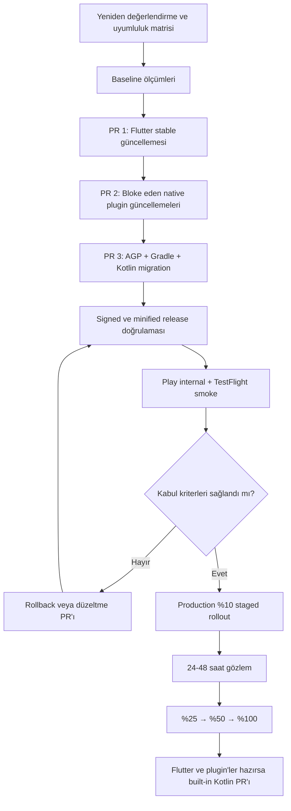

# Android Toolchain Modernizasyonu — Ertelenmiş Migration Planı

## Belge Durumu

| Alan | Değer |
|---|---|
| Durum | **Ertelendi — uygulama değişikliği yapılmayacak** |
| Karar tarihi | 18 Ağustos 2026 |
| Son değerlendirme | 18 Ağustos 2026 |
| İlgili PR | [#39 — Kotlin Gradle Plugin 2.4.10](https://github.com/cemililik/Saydin.Client/pull/39) |
| Kapsam | Flutter, Kotlin, Android Gradle Plugin, Gradle, Android native plugin'leri ve release doğrulaması |
| Yeniden değerlendirme | Bu belgedeki [tetikleyicilerden](#yeniden-değerlendirme-tetikleyicileri) biri gerçekleştiğinde |

> [!IMPORTANT]
> Bu belge bir uygulama talimatı değil, ertelenmiş teknik yatırımın karar ve
> migration kaydıdır. Buradaki sürüm numaraları değerlendirme tarihindeki
> referans hedeflerdir. Çalışmaya başlanacağı gün bütün hedef sürümler resmî
> uyumluluk tablolarından yeniden doğrulanmalıdır.

## Karar Özeti

Saydın Android toolchain'inin güncel tutulması uzun vadede doğru yatırımdır.
Ancak Kotlin'i tek başına `2.2.20` sürümünden `2.4.10` sürümüne çıkaran PR #39,
mevcut proje yapılandırmasıyla Android build'ini kırmaktadır. Kotlin 2.4 için
gerekli AGP/R8 seviyesi, Flutter'ın AGP 9 geçiş gereksinimleri ve eski native
Flutter plugin'leri birlikte ele alınmadan bu değişiklik güvenle yayınlanamaz.

Bu nedenle aşağıdaki karar alınmıştır:

1. PR #39 mevcut haliyle merge edilmeyecek.
2. Kotlin/AGP modernizasyonu şimdilik ertelenecek.
3. Geçiş, yeniden gündeme alındığında tek satırlık dependency bump yerine
   kontrollü ve ölçülebilir bir migration çalışması olarak yürütülecek.
4. Flutter, plugin ve Android toolchain değişiklikleri ayrı ve geri alınabilir
   PR'lara bölünecek.
5. Production'a çıkmadan önce signed/minified AAB, Play internal track ve
   TestFlight doğrulaması tamamlanacak.

## Neden Ertelendi?

Erteleme gerekçesi güncellemenin değersiz olması değil, mevcut ekosistem
durumunda değişikliğin tek başına güvenli olmamasıdır.

### 1. PR #39 Android build'ini deterministik olarak kırıyor

Projede bütün Android subproject'leri şu anda Kotlin dil ve API seviyesi
`1.9` olacak şekilde zorlanıyor:

- [`android/build.gradle.kts`](../android/build.gradle.kts)
- `languageVersion = KOTLIN_1_9`
- `apiVersion = KOTLIN_1_9`

Kotlin 2.4, `-language-version=1.9` desteğini kaldırdığı için PR'ın Android CI
job'ı aşağıdaki hatayla durmaktadır:

```text
Using 'KOTLIN_1_9' is an error. Unsupported
```

İlgili CI sonucu:
[Build Android APK (Debug)](https://github.com/cemililik/Saydin.Client/actions/runs/29716748655/job/88271783082).

Bu ayarı yalnızca kaldırmak yeterli değildir. Ayar, eski Flutter plugin'lerinin
Kotlin dil seviyesi uyumsuzluğunu geçici olarak gidermek için eklenmiştir.

### 2. Kotlin 2.4, mevcut AGP/R8 seviyesinden daha yeni bir Android zinciri istiyor

Android'in resmî uyumluluk matrisine göre Kotlin 2.4 çıktısını desteklemek için
AGP 9.1.0 ve R8 9.1.29 veya daha yenisi gerekir. Proje ise AGP 8.13.2
kullanmaktadır.

Bu ayrım özellikle release build için kritiktir; çünkü release yapılandırmasında
R8 minification ve resource shrinking açıktır:

- [`android/app/build.gradle.kts`](../android/app/build.gradle.kts)
- `isMinifyEnabled = true`
- `isShrinkResources = true`

Debug APK'nin derlenmesi tek başına yeterli kabul edilemez. D8/R8'ın gerçek
release çıktısını güvenle işlemesi ayrıca doğrulanmalıdır.

### 3. AGP 9, Flutter tarafında ayrıca migration gerektiriyor

AGP 9 aşağıdaki iki temel davranışı varsayılan olarak değiştirir:

- Built-in Kotlin entegrasyonu
- Yeni AGP DSL arayüzleri

Proje Flutter 3.41.4'e sabitlenmiştir. Flutter'ın AGP 9 için geçici uyumluluk
desteği 3.44 sürüm hattında gelmiştir. Tam built-in Kotlin'i etkinleştirme
desteği ise değerlendirme tarihinde güncel dokümana göre Flutter 3.47 veya
daha yenisini gerektirmektedir.

Bu nedenle AGP 9 geçişi yapılacaksa önce Flutter SDK ve native plugin tabanı
hazırlanmalıdır.

### 4. Bazı native plugin'ler eski Android build yapılandırması taşıyor

18 Ağustos 2026 tarihli paket denetiminde öne çıkan durumlar:

| Paket | Projedeki sürüm | Gözlenen Android yapılandırması | Migration etkisi |
|---|---:|---|---|
| `sentry_flutter` | 8.14.2 | Kotlin 1.8.0, language level 1.6, AGP 7.4.2 | Global language override'ın temel nedenlerinden biri |
| `share_plus` | 10.1.4 | Kotlin 1.7.22, AGP 8.3.1 | Güncel sürüme geçişte Dart paylaşım API'si değişir |
| `package_info_plus` | 8.3.1 | Kotlin 1.7.22, AGP 8.3.1 | Güncel Android toolchain'e hizalanmalı |
| `shared_preferences_android` | 2.4.21 | Kotlin 2.3.0, AGP 8.13.1 | Yeni toolchain'e daha yakındır; yine de release testi gerekir |
| `flutter_secure_storage` | 9.2.4 | Kotlin uygulamıyor | Toolchain geçişi için major upgrade zorunlu değildir |

Bu tablo paketin kendi arşivindeki Android Gradle dosyaları incelenerek
hazırlanmıştır. Migration başlarken güncel paket sürümleri ve build dosyaları
yeniden denetlenmelidir.

## Mevcut Durum

### Toolchain

| Bileşen | Mevcut sürüm/kural | Kaynak |
|---|---:|---|
| Flutter | 3.41.4 | [`pubspec.yaml`](../pubspec.yaml) |
| Dart SDK constraint | `^3.11.0` | [`pubspec.yaml`](../pubspec.yaml) |
| Android Gradle Plugin | 8.13.2 | [`android/settings.gradle.kts`](../android/settings.gradle.kts) |
| Kotlin Gradle Plugin | 2.2.20 | [`android/settings.gradle.kts`](../android/settings.gradle.kts) |
| Gradle wrapper | 8.14.5 | [`gradle-wrapper.properties`](../android/gradle/wrapper/gradle-wrapper.properties) |
| Java/JVM target | 17 | [`android/app/build.gradle.kts`](../android/app/build.gradle.kts) |
| Kotlin language/API override | 1.9 | [`android/build.gradle.kts`](../android/build.gradle.kts) |
| Release minification | Açık | [`android/app/build.gradle.kts`](../android/app/build.gradle.kts) |

### Native uygulama kodu

Uygulamanın kendi Android Kotlin kodu yalnızca Flutter activity'sini açan
minimal `MainActivity` sınıfıdır:

- [`MainActivity.kt`](../android/app/src/main/kotlin/com/saydin/saydin/MainActivity.kt)

Dolayısıyla Kotlin 2.4'ün yeni dil özellikleri kısa vadede ürün koduna doğrudan
özellik kazandırmayacaktır. Geçişin ana değeri build ekosistemi, destek süresi,
plugin uyumluluğu ve teknik borcun azaltılmasıdır.

## Referans Hedef

18 Ağustos 2026 değerlendirmesinde uyumlu görülen modernizasyon hedefi
aşağıdaki gibidir:

| Bileşen | Mevcut | Değerlendirme tarihindeki referans hedef |
|---|---:|---:|
| Flutter | 3.41.4 | 3.44.7; tam built-in Kotlin için 3.47+ tekrar değerlendirilecek |
| AGP | 8.13.2 | 9.1.1 |
| Gradle | 8.14.5 | 9.3.1 |
| Kotlin | 2.2.20 | 2.4.10 |
| Java | 17 | 17 |
| Android SDK Build Tools | Flutter tarafından seçiliyor | 36.0.0 veya hedef AGP'nin istediği güncel sürüm |
| Kotlin entegrasyonu | Legacy KGP | Önce uyumluluk modu, plugin'ler hazır olduğunda built-in Kotlin |

> [!WARNING]
> Bu tablo doğrudan uygulanmamalıdır. Migration günü Kotlin, AGP, Gradle,
> Flutter, JDK ve Android SDK uyumluluk matrisleri yeniden kontrol edilmelidir.
> Daha yeni bir stabil sürüm yayınlanmışsa en yeni sürüm otomatik olarak
> seçilmemeli; bütün zincirin ortak desteklediği sürüm seçilmelidir.

## Beklenen Getiriler

### Desteklenen toolchain ve daha uzun bakım penceresi

- Kotlin 2.4 sürüm hattı JVM standard library için resmî güvenlik destek
  penceresine sahiptir.
- Yeni Android SDK ve Android Studio sürümleriyle uyumluluk kolaylaşır.
- Yeni Flutter plugin sürümlerinin minimum AGP/Kotlin gereksinimleri daha rahat
  karşılanır.
- Son dakika ve zorunlu büyük sürüm sıçraması riski azalır.

### Android API 37 hazırlığı

AGP 9.1.1, Android API 37 ve altını desteklemektedir. Uygulamanın `compileSdk`
ve `targetSdk` değerleri Flutter tarafından belirlense de uyumlu build zincirine
sahip olmak gelecekteki Google Play gereksinimlerine geçişi kolaylaştırır.

### Daha modern Kotlin/AGP entegrasyonu

AGP 9'un built-in Kotlin modeli:

- Ayrı `kotlin-android` plugin uygulamasını zaman içinde gereksiz hale getirir.
- Eski/deprecated AGP API'lerine bağımlılığı azaltır.
- Android Gradle Plugin ile Kotlin entegrasyonunu sadeleştirir.
- Bazı projelerde Gradle configuration/build maliyetini azaltabilir.

Bu kazanım ancak bütün kritik Flutter plugin'leri built-in Kotlin'e uyumlu
olduğunda tam olarak elde edilir.

### Daha yeni R8 ve resource shrinking

AGP 9 ile optimize resource shrinking, daha katı ProGuard doğrulaması ve daha
yeni DEX/R8 düzeltmeleri gelir. Potansiyel kazanımlar:

- Daha küçük AAB/APK
- Kullanılmayan kod ve resource'ların daha etkili temizlenmesi
- Release build hatalarının daha erken görünmesi
- Incremental dex, lint ve configuration cache alanındaki düzeltmeler

Bu kazanımlar garanti değildir. AAB boyutu, build süresi ve startup davranışı
migration öncesi/sonrası ölçülmelidir.

### Kotlin 2.4 tooling iyileştirmeleri

Kotlin 2.4; daha iyi Gradle Problems API raporlaması, metadata annotation
desteği ve yeni/stabil dil özellikleri getirir. Saydın'ın kendi Kotlin kodu
minimal olduğu için doğrudan ürün etkisi düşük; native plugin ve build tooling
etkisi daha yüksektir.

## Risk Değerlendirmesi

| Risk | Olasılık | Etki | Azaltma |
|---|---|---|---|
| Flutter 3.41.4 ile AGP 9 uyumsuzluğu | Yüksek | Yüksek | Önce desteklenen Flutter stable sürümüne geç |
| Eski plugin'in Kotlin/AGP build'ini kırması | Orta-yüksek | Yüksek | Plugin audit, sürüm yükseltme veya geçici uyumluluk modu |
| Kotlin 1.9 override kaldırılınca plugin compile hatası | Yüksek | Yüksek | Override'ı yalnızca plugin tabanı hazırlandıktan sonra kaldır |
| R8'ın yalnızca release'de runtime crash üretmesi | Orta | Yüksek | Signed/minified AAB, gerçek cihaz ve internal track testi |
| Eksik/yanlış ProGuard keep rule | Orta | Yüksek | Mapping ve shrinker çıktısını incele, kritik akışları smoke test et |
| Sentry 8 → 9 davranış/API değişiklikleri | Orta-yüksek | Yüksek | Ayrı PR, migration guide, PII scrubber testleri, gerçek event doğrulaması |
| Share plugin API/işletim sistemi davranış değişikliği | Orta | Orta | Android ve iOS gerçek cihaz paylaşım testi |
| Flutter/plugin güncellemesinin iOS'u etkilemesi | Orta | Orta-yüksek | iOS CI, IPA ve TestFlight smoke testi |
| Secure storage major upgrade'ında veri migration sorunu | Düşük-orta | Çok yüksek | Toolchain PR'ına dahil etme; ayrı veri migration çalışması yap |
| CI cache ve build süresinin artması | Orta | Düşük-orta | Önce/sonra süre ölçümü, cache anahtarlarını güncelle |
| Büyük tek PR'ın kök neden analizini zorlaştırması | Yüksek | Orta-yüksek | Değişiklikleri bağımsız ve sıralı PR'lara böl |

## Kapsam Sınırları

### Migration kapsamına dahil

- Flutter SDK'nin gerekli stabil sürüme yükseltilmesi
- Kotlin/AGP/Gradle/JDK/Build Tools uyumluluk hizalaması
- Kotlin compiler DSL ve geçici language override'larının temizlenmesi
- Kotlin/AGP geçişini bloke eden native Flutter plugin güncellemeleri
- Android ve iOS CI doğrulaması
- Signed/minified Android AAB ve TestFlight doğrulaması
- AAB boyutu, build süresi ve kritik runtime akışlarının karşılaştırılması

### Aynı çalışmaya otomatik olarak dahil edilmemeli

- Bütün Dart paketlerini topluca en son major sürüme çıkarmak
- `flutter_secure_storage` 9 → 11 veri/şifreleme migration'ı
- Ürün özelliği veya UI değişikliği
- Android `minSdk`/`targetSdk` değişikliği; toolchain zorunlu kılmıyorsa
- ProGuard kurallarını kanıt olmadan topluca silmek veya gevşetmek
- Built-in Kotlin hazır değilken geçici uyumluluk flag'lerini erken kaldırmak

Bu sınırlar regression alanını ve rollback maliyetini düşük tutmak içindir.

## Plugin Bazlı Notlar

### Sentry

Projede Sentry yalnızca standart hata yakalama için kullanılmamaktadır. Özel
PII temizleme, breadcrumb filtreleme, transaction temizleme ve KVKK kuralları
bulunur:

- [`lib/core/observability/sentry_pii_scrubber.dart`](../lib/core/observability/sentry_pii_scrubber.dart)
- [`lib/main.dart`](../lib/main.dart)
- [`test/core/observability/sentry_pii_scrubber_test.dart`](../test/core/observability/sentry_pii_scrubber_test.dart)

Sentry 9 geçişi breaking değişiklikler içerir. Özellikle mutable event modeline
geçiş, `copyWith`/`clone` deprecation'ları, transaction callback'leri, ANR ve
privacy varsayılanları kontrol edilmelidir.

Sentry migration kabul kriterleri:

- Bütün PII scrubber testleri geçmeli.
- `beforeSend`, `beforeBreadcrumb` ve `beforeSendTransaction` davranışları
  korunmalı.
- Screenshot ve view hierarchy gönderilmediği doğrulanmalı.
- Finansal tutar, sembol ve tarih gibi hassas verilerin event'e sızmadığı
  Sentry test projesinde kontrol edilmeli.
- Android release mapping/symbolication stratejisi doğrulanmalı.
- iOS crash/error event gönderimi ayrıca test edilmeli.

### Share Plus

Mevcut kod `Share.shareXFiles(...)` kullanır:

- [`lib/core/utils/share_card_renderer.dart`](../lib/core/utils/share_card_renderer.dart)

Güncel API `SharePlus.instance.share(ShareParams(...))` modeline geçmiştir.
Migration sonrasında en az aşağıdakiler gerçek cihazda test edilmelidir:

- PNG dosyasının Android share sheet'te görünmesi
- Metin + dosya kombinasyonu
- WhatsApp/mesaj/e-posta gibi temel hedefler
- iOS share sheet ve iPad popover davranışı
- Dialog kapandıktan sonra geçici finansal görselin silinmesi

### Package Info Plus

Paket bilgisi uygulama başlangıcında DI'a kaydedilir ve hem API header'ları hem
Sentry device context için kullanılır:

- [`lib/core/di/injection.dart`](../lib/core/di/injection.dart)
- [`lib/core/network/device_info_interceptor.dart`](../lib/core/network/device_info_interceptor.dart)
- [`lib/core/observability/sentry_device_context.dart`](../lib/core/observability/sentry_device_context.dart)

Upgrade sonrası app version/build number ve installer store alanları kontrol
edilmelidir.

### Flutter Secure Storage

Secure storage cihaz UUID'sini ve kullanıcıya ait hassas yerel verileri
barındırır. Güncel major sürümlerde Android cipher ve migration davranışları
değişebildiği için toolchain geçişinden ayrılmalıdır.

Migration sırasında mevcut `9.2.4` sürümü toolchain'i bloke etmiyorsa korunmalı;
major upgrade ayrı veri koruma ve rollback planıyla yapılmalıdır.

## Önerilen Migration Stratejisi



### Aşama 0 — Yeniden doğrulama ve baseline

Kod değişikliğine başlamadan önce:

1. Güncel stabil Flutter sürümünü ve AGP 9 desteğini kontrol et.
2. Kotlin–AGP–R8, KGP–Gradle–AGP ve AGP–Gradle–JDK matrislerini doğrula.
3. `flutter pub outdated` ile native plugin'leri çıkar.
4. Her Android plugin'inin `android/build.gradle(.kts)` dosyasında aşağıdakileri
   ara:
   - `kotlin-android`
   - `org.jetbrains.kotlin.android`
   - Sabit `kotlin_version`
   - `languageVersion` / `apiVersion`
   - Eski AGP classpath'i
   - Legacy `BaseExtension` / variant API kullanımı
5. Mevcut başarılı release AAB'nin boyutunu, build süresini ve mapping çıktısını
   baseline olarak kaydet.
6. Mevcut Android/iOS kritik akış smoke sonuçlarını kaydet.

### Aşama 1 — Flutter stable güncellemesi

- `pubspec.yaml` içindeki exact Flutter pin'ini seçilen stabil sürüme çıkar.
- CI'daki `flutter-version-file` kullanımını koru.
- `flutter pub get`, l10n generation, analyze ve bütün testleri çalıştır.
- Android debug ve iOS no-codesign build'i doğrula.
- Bu aşamada AGP/Kotlin değişikliğini zorunlu olmadıkça ekleme.

Amaç, Flutter kaynaklı regresyonları Android toolchain değişikliklerinden
ayırmaktır.

### Aşama 2 — Bloke eden plugin'leri modernize et

Önerilen öncelik:

1. `sentry_flutter`
2. `share_plus`
3. `package_info_plus`
4. Gerekli transitive Android plugin'leri

Her major package ayrı commit veya mümkünse ayrı PR olmalıdır. `pubspec.lock`
değişikliği ve kaynak API migration'ı birlikte test edilmelidir.

`flutter_secure_storage` major migration'ı bu aşamaya otomatik olarak dahil
edilmemelidir.

### Aşama 3 — Android toolchain'i hizala

Migration günü seçilen resmî uyumlu sürümlerle:

- Gradle wrapper ve SHA-256 değerini güncelle.
- AGP sürümünü güncelle.
- Legacy mod kullanılıyorsa KGP sürümünü güncelle.
- Java/JVM target hizasını doğrula.
- Eski `android.kotlinOptions` kullanımını `kotlin.compilerOptions` DSL'ine taşı.
- Global `languageVersion/apiVersion = 1.9` override'ını kaldır.
- Flutter'ın o sürüm için istediği `android.newDsl` ve
  `android.builtInKotlin` davranışını açık ve deterministik ayarla.
- Android SDK/Build Tools paketlerinin CI runner'da bulunduğunu doğrula.

> [!CAUTION]
> Compatibility flag'leri kalıcı çözüm kabul edilmemelidir. Ancak plugin
> ekosistemi hazır değilse kontrollü geçiş için kullanılabilir. Hangi flag'in
> neden açık olduğu dosya içinde yorumla ve kaldırma koşulunu bu belgeye bağla.

### Aşama 4 — Tam built-in Kotlin

Bu aşama ancak aşağıdaki koşullar birlikte sağlandığında yapılmalıdır:

- Kullanılan Flutter stable sürümü built-in Kotlin'i resmen destekliyor.
- Bütün kritik Android Flutter plugin'leri AGP 9 built-in Kotlin ile uyumlu.
- Hiçbir plugin koşulsuz legacy `kotlin-android` uygulamıyor.
- Yeni AGP DSL ile debug ve release build'leri geçiyor.

Bu aşamada:

- Uygulama modülünden `kotlin-android` kaldırılır.
- Ayrı KGP plugin sürüm deklarasyonu gereksizse kaldırılır.
- `android.builtInKotlin=true` kullanılır.
- `android.newDsl=true` kullanılır.
- Geçici uyumluluk yorumları ve flag'leri temizlenir.

## Validasyon Planı

### Statik ve birim kontroller

```bash
flutter gen-l10n
dart format --output=none --set-exit-if-changed lib/ test/
flutter analyze --fatal-infos
flutter test --coverage
```

### Build kontrolleri

```bash
# Debug Android sanity build
flutter build apk --debug \
  --dart-define=API_BASE_URL=http://10.0.2.2:5080 \
  --dart-define=APP_ENV=development

# Release Android — signing ve gerçek environment CI tarafından sağlanır
flutter build appbundle --release \
  --dart-define=API_BASE_URL="${SAYDIN_PRODUCTION_API_BASE_URL:?set production API URL}" \
  --dart-define=APP_ENV=production

# iOS kaynak/plugin regresyon kontrolü
flutter build ios --no-codesign \
  --dart-define=API_BASE_URL="${SAYDIN_STAGING_API_BASE_URL:?set staging API URL}" \
  --dart-define=APP_ENV=staging
```

Signed release AAB sadece CI secret'ları üzerinden üretilmelidir. Keystore veya
şifreler komut satırına, log'a ya da committed dosyaya yazılmamalıdır.

### Android kritik akış smoke listesi

- Uygulama temiz kurulumda açılıyor.
- Mevcut sürümün üzerine update edildiğinde açılıyor.
- Onboarding ve ayarlar korunuyor.
- Tema ve dil tercihi uygulama yeniden başlatıldığında korunuyor.
- Device ID secure storage'da korunuyor; upgrade sonrası gereksiz yeni ID
  üretilmiyor.
- API isteklerinde uygulama sürümü, cihaz ve dil header'ları doğru.
- Normal ve ters “ya alsaydım” hesaplaması çalışıyor.
- Senaryo/favori/portföy yerel verileri okunabiliyor.
- PNG paylaşımı ve geçici dosya temizliği çalışıyor.
- Sentry error, breadcrumb ve transaction event'leri geliyor.
- Sentry payload'ında finansal PII bulunmuyor.
- Release build'de class/resource bulunamama crash'i yok.

### iOS/TestFlight smoke listesi

Kotlin/AGP doğrudan iOS'u değiştirmese de Flutter ve plugin major upgrade'leri
iOS native kodunu etkileyebilir:

- IPA üretiliyor ve TestFlight'a yükleniyor.
- Uygulama temiz kurulumda ve upgrade senaryosunda açılıyor.
- Secure storage verileri korunuyor.
- Share sheet açılıyor ve PNG paylaşılabiliyor.
- Sentry event ve transaction gönderimi çalışıyor.
- App version/build number doğru okunuyor.

### Ölçülecek metrikler

| Metrik | Baseline | Kabul yaklaşımı |
|---|---|---|
| Debug Android build süresi | Migration öncesi ölç | Açıklanamayan belirgin artış araştırılır |
| Release AAB build süresi | Migration öncesi ölç | CI timeout veya maliyet artışı olmamalı |
| AAB download/install size | Migration öncesi ölç | Artış varsa dependency/R8 nedeni belgelenmeli |
| Cold start | Internal cihazda ölç | Kullanıcı fark edilir regresyon olmamalı |
| Crash-free sessions | Mevcut Sentry/Play baseline | Internal ve staged rollout'ta düşmemeli |
| Sentry event doğruluğu | Test event baseline | PII temizliği ve symbolication korunmalı |

## Release ve Rollback Planı

Mevcut release modeli migration için uygundur:

- RC tag → Play Store `internal` draft
- Production tag → Play Store `%10` staged rollout
- iOS → TestFlight

Detaylar:

- [`docs/development-guide.md`](development-guide.md)
- [`.github/workflows/release.yml`](../.github/workflows/release.yml)

Önerilen yayın sırası:

1. RC tag ile Android internal ve TestFlight build'i üret.
2. En az 24–48 saat ekip/iç test yap.
3. Sentry ve Play Console crash/ANR verisini kontrol et.
4. Production tag ile `%10` rollout başlat.
5. Sağlıklıysa `%25 → %50 → %100` ilerlet.
6. Crash veya veri kaybı şüphesinde rollout'u durdur.

Rollback yaklaşımı:

- Toolchain PR'ları işlevsel olarak küçük tutulduğu için kaynak kod rollback'i
  kolay olmalıdır.
- Store'a gönderilmiş version code tekrar kullanılamaz; rollback gerekiyorsa
  önceki toolchain'i geri getiren yeni patch sürüm hazırlanır.
- Secure storage veri formatını değiştiren migration aynı release'e alınmadığı
  sürece toolchain rollback'inin kullanıcı verisine dokunmaması beklenir.
- R8/ProGuard problemi varsa önce eksik keep rule düzeltilir; minification'ı
  kalıcı olarak kapatmak çözüm kabul edilmez.

## Maliyet ve Kaynak Tahmini

Bu tahmin 18 Ağustos 2026 tarihindeki proje yapısına göredir:

| İş kalemi | Tahmini efor |
|---|---:|
| Güncel uyumluluk ve plugin audit'i | 0.5–1 kişi-gün |
| Flutter stable güncellemesi | 0.5–1 kişi-gün |
| Sentry major migration ve PII doğrulaması | 1–2 kişi-gün |
| Share/package info ve diğer gerekli plugin uyarlamaları | 0.5–1 kişi-gün |
| AGP/Gradle/Kotlin build migration'ı | 1–1.5 kişi-gün |
| CI, signing, AAB/IPA ve artifact doğrulaması | 0.5–1 kişi-gün |
| Android/iOS smoke, internal release ve gözlem | 1–2 kişi-gün |
| **Beklenen toplam** | **5–8 kişi-gün** |

Planlama rezervi:

- Beklenen: 5–8 kişi-gün
- Bütçelenmesi önerilen: 8 kişi-gün
- Plugin fork'u veya ciddi R8 sorunu çıkarsa üst sınır: 10–12 kişi-gün
- Tek geliştiriciyle tahmini takvim: 1–2 hafta; internal gözlem süresi dahil

Doğrudan lisans maliyeti beklenmez. Maliyet ağırlıklı olarak mühendislik/QA
zamanı ve olası ek CI dakikalarıdır.

## Yeniden Değerlendirme Tetikleyicileri

Aşağıdaki durumlardan biri gerçekleştiğinde bu plan backlog'a alınmalıdır:

- Flutter'ın built-in Kotlin destekleyen stabil sürümü yayınlanır ve proje bu
  sürüme yükseltilmek istenir.
- Kritik bir plugin mevcut Kotlin/AGP sürümünü artık desteklemez.
- Google Play target/compile SDK gereksinimi mevcut AGP hattıyla karşılanamaz.
- Kotlin/AGP/R8 için güvenlik veya kritik build düzeltmesi gerekir.
- Android Studio/CI runner mevcut Gradle veya AGP sürümünü desteklememeye başlar.
- Yeni bir Android özelliği AGP 9+ gerektirir.
- Mevcut global Kotlin language override'ı başka dependency güncellemelerini
  engellemeye başlar.
- Takımın 5–8 kişi-günlük migration kapasitesi ve gerçek cihaz QA zamanı hazırdır.

Plan en geç bir sonraki Flutter stable ana sürüm değerlendirmesinde veya altı
ay içinde, hangisi önce gelirse, yeniden gözden geçirilmelidir.

## Çalışmaya Başlama Kontrol Listesi

- [ ] Migration için sorumlu ve hedef sprint belirlendi.
- [ ] Güncel Flutter stable sürümü doğrulandı.
- [ ] Kotlin–AGP–R8 uyumluluk matrisi doğrulandı.
- [ ] KGP–Gradle–AGP uyumluluk matrisi doğrulandı.
- [ ] AGP–Gradle–JDK/Build Tools uyumluluğu doğrulandı.
- [ ] Native Flutter plugin audit'i yenilendi.
- [ ] Sentry migration kapsamı ve test planı onaylandı.
- [ ] Baseline AAB boyutu/build süresi kaydedildi.
- [ ] Android ve iOS gerçek test cihazları hazır.
- [ ] Play internal ve TestFlight erişimi doğrulandı.
- [ ] Rollback/hotfix sorumlusu belirlendi.

## Tamamlanma Kriterleri

Migration ancak aşağıdakilerin tamamı sağlandığında tamamlandı sayılır:

- [ ] Uyumlu ve güncel Flutter/AGP/Gradle/Kotlin zinciri belgelenmiş.
- [ ] Geçersiz Kotlin 1.9 language/API override'ı kaldırılmış.
- [ ] `flutter analyze --fatal-infos` başarılı.
- [ ] Bütün testler ve l10n generation başarılı.
- [ ] Android debug APK başarılı.
- [ ] Signed ve minified Android release AAB başarılı.
- [ ] iOS no-codesign build ve TestFlight IPA başarılı.
- [ ] Android/iOS kritik smoke testleri başarılı.
- [ ] Secure storage ve yerel tercihlerin update senaryosunda korunduğu kanıtlanmış.
- [ ] Sentry event/transaction ve PII scrubber doğrulanmış.
- [ ] AAB boyutu ve build süresi karşılaştırması belgelenmiş.
- [ ] Play internal gözleminde kritik crash/ANR yok.
- [ ] Production `%10` rollout sağlıklı tamamlanmış.
- [ ] Geçici compatibility flag'leri için kaldırma koşulu belgelenmiş.
- [ ] Bu dokümanın durumu `Tamamlandı` olarak güncellenmiş.

## Resmî Kaynaklar

- [Kotlin 2.4 yenilikleri](https://kotlinlang.org/docs/whatsnew24.html)
- [Kotlin 2.4 uyumluluk rehberi](https://kotlinlang.org/docs/compatibility-guide-24.html)
- [Kotlin release ve güvenlik destek süreci](https://kotlinlang.org/docs/releases.html)
- [Kotlin Gradle/AGP uyumluluk tablosu](https://kotlinlang.org/docs/gradle-configure-project.html)
- [Android Kotlin/AGP/R8 destek matrisi](https://developer.android.com/build/kotlin-support)
- [Android Gradle Plugin 9.0 release notes](https://developer.android.com/build/releases/agp-9-0-0-release-notes)
- [Android Gradle Plugin 9.1 release notes](https://developer.android.com/build/releases/agp-9-1-0-release-notes)
- [Flutter AGP 9 ve built-in Kotlin migration](https://docs.flutter.dev/release/breaking-changes/migrate-to-built-in-kotlin)
- [Flutter built-in Kotlin — app developer guide](https://docs.flutter.dev/release/breaking-changes/migrate-to-built-in-kotlin/for-app-developers)
- [Sentry Flutter changelog](https://pub.dev/packages/sentry_flutter/changelog)
- [Share Plus changelog](https://pub.dev/packages/share_plus/changelog)
- [Package Info Plus](https://pub.dev/packages/package_info_plus)

## Karar Geçmişi

| Tarih | Karar |
|---|---|
| 18 Ağustos 2026 | PR #39 incelendi; Kotlin 2.4'ün tek başına merge edilemeyeceği doğrulandı. |
| 18 Ağustos 2026 | Kotlin/AGP modernizasyonu dokümante edilerek ertelendi. |
