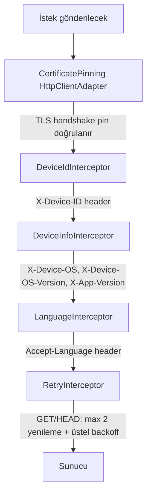
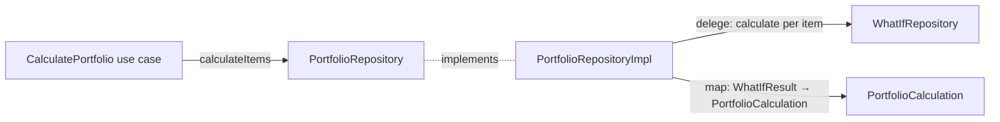

# Saydin.Client — Mimari

## Genel Yapı

Feature-first Clean Architecture + BLoC pattern. Her özellik kendi klasöründe bağımsız olarak bulunur.

```
lib/
├── core/                          ← Özelliklerden bağımsız altyapı
│   ├── constants/                 ← AppColors, ApiEndpoints
│   ├── di/                        ← injection.dart (get_it service locator)
│   ├── error/                     ← AppError, DioErrorMapper, ErrorReporter
│   ├── l10n/                      ← L10nContext extension (context.l10n)
│   ├── network/                   ← ApiClient, *Interceptor, LocaleProvider (Accept-Language)
│   ├── platform/                  ← PlatformInfo (dart:io soyutlaması — F-05-06)
│   ├── theme/                     ← AppTheme (light/dark ThemeData), ThemeModeMapper
│   ├── utils/                     ← date_utils (isSameDay), money_parser, percentage_formatter, ...
│   └── widgets/                   ← InflationToggle, SharePreviewSheet, SettingsIconButton
├── features/
│   ├── what_if/                   ← Ana özellik: "ya alsaydım" hesaplama
│   │   ├── data/
│   │   │   ├── models/            ← AssetModel, WhatIfResultModel, ReverseWhatIfResponseModel (fromJson)
│   │   │   └── repositories/     ← WhatIfRepositoryImpl (Dio çağrıları burada)
│   │   ├── domain/
│   │   │   ├── entities/          ← Asset (allowedAmountTypes getter dahil), WhatIfResult, ReverseWhatIfResult
│   │   │   ├── repositories/     ← WhatIfRepository (abstract interface)
│   │   │   └── usecases/         ← GetAssets, CalculateWhatIf, CalculateReverseWhatIf
│   │   └── presentation/
│   │       ├── bloc/              ← WhatIfBloc, WhatIfEvent, WhatIfState, WhatIfFormInput
│   │       ├── pages/             ← WhatIfPage
│   │       └── widgets/           ← AssetSelector (bottom sheet + arama), DateInput (asset tarih aralığı),
│   │                                 AmountInput (dinamik tip/ikon), ResultCard, ReverseResultCard,
│   │                                 ResultChart (fl_chart), ReverseShareCardWidget
│   ├── scenarios/                 ← Kaydedilen senaryolar
│   │   ├── data/
│   │   │   ├── models/            ← SavedScenarioModel (fromJson)
│   │   │   └── repositories/     ← ScenariosRepositoryImpl
│   │   ├── domain/
│   │   │   ├── entities/          ← SavedScenario
│   │   │   ├── repositories/     ← ScenariosRepository (abstract interface)
│   │   │   └── usecases/         ← GetScenarios, SaveScenario, DeleteScenario
│   │   └── presentation/
│   │       ├── bloc/              ← ScenariosBloc, ScenariosEvent, ScenariosState
│   │       ├── pages/             ← ScenariosPage (swipe-to-delete, refresh)
│   │       └── widgets/           ← ScenarioCard (avatar, Dismissible)
│   └── settings/                  ← Kullanıcı ayarları (tema, gelecek tercihler)
│       ├── data/
│       │   └── repositories/     ← SettingsRepositoryImpl (SharedPreferences)
│       ├── domain/
│       │   ├── entities/          ← AppSettings (themeMode, language + copyWith)
│       │   └── repositories/     ← SettingsRepository (abstract interface)
│       └── presentation/
│           ├── cubit/             ← SettingsCubit (LazySingleton)
│           ├── pages/             ← SettingsPage
│           └── widgets/           ← ThemeSelectorTile, LanguageSelectorTile (SegmentedButton)
└── l10n/                          ← flutter gen-l10n çıktısı (commit'lenir)
    ├── app_localizations.dart
    ├── app_localizations_tr.dart
    ├── app_localizations_en.dart
    ├── app_tr.arb                 ← Türkçe kaynak dosya
    └── app_en.arb                 ← İngilizce kaynak dosya
```

## Katman Mimarisi

```
presentation → domain ← data
```

- `data` katmanı `domain` repository interface'lerini implement eder
- `presentation` katmanı `domain` entity ve use case'lerini kullanır
- `data` ve `presentation` birbirini referans almaz
- **Domain katmanında `package:flutter` import YASAKTIR** — saf Dart kalmalıdır

## Bağımlılık Enjeksiyonu (get_it)

`lib/core/di/injection.dart` içinde `sl` (service locator) nesnesi merkezi olarak konfigüre edilir. Code generation (`injectable`, `build_runner`) **kullanılmaz** — kayıtlar elle yazılır.

| Kayıt Tipi | Kullanıldığı Yer | Gerekçe |
|---|---|---|
| `registerLazySingleton` | ApiClient, Repository, UseCase, DioErrorMapper, ErrorReporter, SettingsCubit, OnboardingCubit, `PlatformInfo`, `LocaleProvider`, `PortfolioRepository` | Bir kez oluşturulur, tüm uygulama boyunca paylaşılır |
| `registerFactory` | WhatIfBloc, ComparisonBloc, PortfolioBloc, DcaBloc, ScenariosBloc | Her sayfa açılışında yeni instance — eski state sızmaz |

> **Faz 5 eklemeleri:** `PlatformInfo` (network'ün `dart:io`'dan soyutlanması),
> `LocaleProvider` (dil kodu global static yerine DI), `OnboardingCubit`
> (onboarding durumu), `PortfolioRepository` (portföyün kendi data katmanı).
> `DioErrorMapper` artık BLoC'lara değil **repository'lere** enjekte edilir.

```dart
// Sayfa açılırken BLoC sağlanır
BlocProvider(
  create: (_) => sl<WhatIfBloc>()..add(const WhatIfAssetsRequested()),
  child: const WhatIfPage(),
)
```

## BLoC State Makineleri

### WhatIfBloc

Form alanları `WhatIfFormInput` veri sınıfında taşınır ve tüm state'lere gömülüdür. Bu sayede hesaplama başarısız olsa bile form değerleri kaybolmaz.

**Hesaplama Modu:** `CalculationMode` enum'u (`normal` | `reverse`) ile iki hesaplama modu desteklenir. `SegmentedButton` ile kullanıcı mod değiştirebilir.

```
WhatIfInitial
    │
    │ WhatIfAssetsRequested
    ▼
WhatIfAssetsLoading
    ├─ başarı ──► WhatIfAssetsLoaded(assets, formInput)
    └─ hata ───► WhatIfFailure(assets: [], error, formInput)

WhatIfAssetsLoaded / WhatIfSuccess / WhatIfFailure
    │
    │ WhatIfSymbolChanged
    ▼
    Aynı state, formInput güncellenerek yeniden emit edilir.
    • amountType yeni asset için geçersizse → 'try'e sıfırlanır
    • buyDate/sellDate asset'in [firstDate, lastDate] dışındaysa → sıkıştırılır,
      formInput.dateAdjusted = true (tek seferlik flag — UI snackbar gösterir, sonra false olur)

    │ WhatIfModeChanged(CalculationMode)
    ▼
    formInput.calculationMode güncellenir.
    Ters modda amountType otomatik 'try'e zorlanır (hedef tutar yalnızca TL).

    │ WhatIfBuyDateChanged / WhatIfSellDateChanged / WhatIfAmountTypeChanged
    ▼
    Aynı state, formInput güncellenerek yeniden emit edilir

    │ WhatIfCalculateRequested (normal mod)
    ▼
WhatIfCalculating(assets, formInput)
    ├─ başarı ──► WhatIfSuccess(assets, result: WhatIfResult, formInput)
    └─ hata ───► WhatIfFailure(assets, error, formInput)

    │ WhatIfReverseCalculateRequested (ters mod)
    ▼
WhatIfCalculating(assets, formInput)
    ├─ başarı ──► WhatIfSuccess(assets, reverseResult: ReverseWhatIfResult, formInput)
    └─ hata ───► WhatIfFailure(assets, error, formInput)
```

**`WhatIfSuccess` state'i:** `result` (nullable `WhatIfResult`) ve `reverseResult` (nullable `ReverseWhatIfResult`) taşır. Mod'a göre yalnızca biri dolu olur.

**`WhatIfFormInput` alanları:**

| Alan | Tip | Açıklama |
|---|---|---|
| `selectedSymbol` | `String?` | Seçili asset sembolü |
| `buyDate` | `DateTime?` | Alış tarihi |
| `sellDate` | `DateTime?` | Satış tarihi (opsiyonel) |
| `amountType` | `String` | `try` \| `units` \| `grams` |
| `amount` | `num?` | Tutar (replay/senaryo yüklemede doldurulur) |
| `calculationMode` | `CalculationMode` | `normal` veya `reverse` — hesaplama modunu belirler |
| `includeInflation` | `bool` | Enflasyon düzeltmesi dahil mi |
| `dateAdjusted` | `bool` | Sembol değişince tarih sıkıştırıldıysa `true` — bir kez UI'a iletildikten sonra `copyWith` ile otomatik `false`'a döner (one-shot flag) |

**State kuralları:**
- Tüm state'ler `Equatable` implement eder → gereksiz widget rebuild önlenir
- `List<Asset>` alanları `List.unmodifiable()` ile sarılır — dış mutasyon engellenir
- **Hata mesajı BLoC üretmez** — yalnızca `AppError` tipi taşır (bkz. ADR-006)

### ScenariosBloc

Silme işlemi **optimistic** yapılır: API çağrısından önce öğe UI'dan kaldırılır, hata durumunda liste eski haline döndürülür.

```
ScenariosInitial
    │ ScenariosRequested
    ▼
ScenariosLoading
    ├─ başarı ──► ScenariosLoaded(scenarios)
    └─ hata ───► ScenariosFailure(scenarios: [], error)

ScenariosLoaded
    │ ScenarioDeleteRequested
    ▼
    ScenariosLoaded(scenarios - silinen)   ← hemen (optimistic)
    └─ API hata ──► ScenariosFailure(scenarios orijinal, error)

    │ ScenarioSaveRequested
    ├─ duplicate ──► ScenariosDuplicate(scenarios)  ← API'ye gidilmez, UI snackbar gösterir
    ▼
ScenariosSaving(scenarios)
    ├─ başarı ──► ScenariosLoaded([yeni, ...scenarios])
    └─ hata ───► ScenariosFailure(scenarios, error)
```

**Duplicate kontrolü:** Kaydetmeden önce mevcut liste; `assetSymbol` + `buyDate` + `sellDate` + `amount` + `amountType` bileşimine göre taranır. Aynı kombinasyon zaten varsa `ScenariosDuplicate` emit edilir — API çağrısı yapılmaz.

## Domain Mantığı — Asset

`Asset` entity'si saf Dart olmasına karşın tutar tipi kısıtlarını ve veri aralığını da taşır:

```dart
class Asset {
  final String symbol;
  final String displayName;
  final String category;
  final DateTime? firstDate;   // Veritabanındaki en eski fiyat tarihi
  final DateTime? lastDate;    // Veritabanındaki en yeni fiyat tarihi

  // Tutar tipi kısıtı:
  // 'precious_metal' → ['try', 'grams']
  // diğerleri        → ['try', 'units']
  List<String> get allowedAmountTypes { ... }
}
```

`firstDate`/`lastDate` alanları `GET /assets` yanıtından (`firstPriceDate`/`lastPriceDate`) parse edilir ve `DateInput` widget'larına geçirilerek takvim aralığı kısıtlanır.

Asset değiştiğinde `WhatIfBloc._onSymbolChanged`:
1. Mevcut `amountType` yeni asset için geçersizse → `'try'`'a sıfırlar
2. `buyDate`/`sellDate` yeni asset'in `[firstDate, lastDate]` dışındaysa → sıkıştırır (`dateAdjusted = true`)

`AmountInput` widget'ı da `allowedAmountTypes` listesini kullanarak dropdown seçeneklerini ve prefix ikonu dinamik olarak gösterir:

| amountType | Prefix ikon |
|---|---|
| `try` | `Icons.currency_lira` |
| `units` | `Icons.tag` |
| `grams` | `Icons.scale_outlined` |

## Ağ Katmanı

### Interceptor Zinciri



- **CertificatePinning** sertifika doğrulama katmanıdır — interceptor değil,
  Dio'nun `IOHttpClientAdapter`'i üzerinde TLS handshake aşamasında çalışır.
  Detay: ADR-013 — Saydın meta repo: `docs/decisions/ADR-013-certificate-pinning-strategy.md` (komşu repo; göreceli link GitHub'da çözülmez).

### DeviceIdInterceptor

`FlutterSecureStorage` ile `saydin_device_id` anahtarı altında UUID v4 saklanır.
**Fallback:** Storage erişimi başarısız olursa oturum süreli ephemeral UUID kullanılır — kullanıcı hata görmez.

### DeviceInfoInterceptor

Her isteğe `X-Device-OS`, `X-Device-OS-Version`, `X-App-Version` header'larını
ekler — backend activity logging için.

**Platform soyutlaması (F-05-06):** İşletim sistemi bilgisi `dart:io.Platform`
yerine DI ile enjekte edilen `PlatformInfo` arayüzünden okunur
([lib/core/platform/platform_info.dart](../lib/core/platform/platform_info.dart)).
Böylece network/interceptor katmanı `dart:io` import etmez ve birim testlerde
sahte (`FakePlatformInfo`) implementasyonla doğrulanabilir. Production'da
`SystemPlatformInfo` `Platform.operatingSystem`'i sarar.

**PII minimizasyonu:** `Platform.operatingSystemVersion` ham çıktısı iOS'ta
build numarası + Darwin kernel sürümü ile 80+ karakter olabilir. Bu
fingerprinting riski yaratır → `minimizeOsVersion` regex ile major.minor
düzeyine indirilir (örn. `"18.6"`). Eşleşme yoksa `"unknown"` döner; ham
veri ASLA propagate edilmez. (`minimizeOsVersion` static helper olarak kalır.)

### LanguageInterceptor

Her istekte `Accept-Language` header'ını DI ile enjekte edilen `LocaleProvider`
([lib/core/network/locale_provider.dart](../lib/core/network/locale_provider.dart))
üzerinden okur. `SettingsCubit` dil değiştiğinde aynı `LocaleProvider`
instance'ını günceller — `LazySingleton` olduğu için interceptor ve cubit tek
instance'ı paylaşır.

> **F-12-17 + F-05-27:** Önceden dil kodu global **mutable static**
> `AppLocaleHolder.code` idi; testlerde izole edilemiyor ve `SettingsCubit`
> global state'i doğrudan mutasyona uğratıyordu. Artık `LocaleProvider` arayüzü
> DI ile enjekte edilir (`AppLocaleHolder` onu implement eden bellek-içi
> tutucu); test sahte bir provider'a `verify` yapar.

| Kullanıcı seçimi | Accept-Language | Sonuç |
|---|---|---|
| Türkçe | `tr` | Backend Türkçe yanıt verir |
| English | `en` | Backend İngilizce yanıt verir |
| Sistem | Platform locale | Cihaz diline göre |

### RetryInterceptor

- Kapsam: yalnızca GET ve HEAD (idempotent)
- Tetikleyici: `connectionError`, `receiveTimeout`, `connectionTimeout` **ve geçici
  5xx: 502/503/504** (Faz 6 — F-05-09). Bunlar gateway/erişilemezlik/upstream
  hatalarıdır (örn. backend `external-api` 502'si, deploy/restart 503/504) ve
  geçicidir.
- Yenilenmeyenler: tüm 4xx (deterministik domain/validation) **ve 500**
  (`internal-error` — genelde deterministik; retry yükü artırır, çözmez).
- Gecikme: `min(200 * 2^attempt, 2000) + jitter(0..100)` ms

## Hata Yönetimi

### AppError Hiyerarşisi (`sealed class`)

```dart
sealed class AppError { ... }
class PriceNotFoundError    extends AppError { ... } // 404 price-not-found
class AssetNotFoundError    extends AppError { ... } // 404 asset-not-found (Faz 6)
class DailyLimitError       extends AppError {        // 429 daily-limit-exceeded
  final DateTime resetAt;
}
class ScenarioLimitError    extends AppError {        // 422 scenario-limit-exceeded
  final int limit;
}
class NoInternetError       extends AppError { ... } // connectionError
class ServerError           extends AppError {        // 5xx / 4xx (eşlenmemiş)
  final int? statusCode;
}
class MalformedResponseError extends AppError { ... } // 2xx + boş/bozuk gövde (Faz 6)
class UnknownError          extends AppError { ... } // catch-all + DioException 'unknown'
```

`sealed` keyword'ü exhaustive `switch` sağlar: yeni hata tipi eklenip widget güncellenmezse **derleme hatası** alınır. Faz 6'da iki yeni varyant eklendi:
- **`AssetNotFoundError`** — backend 404 `asset-not-found` (önceden tüm 404'ler
  `PriceNotFoundError`'a indirgeniyordu; silinmiş varlık replay'inde yanıltıcı
  "fiyat bulunamadı" mesajı çıkıyordu — F-05-11).
- **`MalformedResponseError`** — sunucu 2xx döndü ama gövde boş/ayrıştırılamaz
  (`ServerError(statusCode: 200)` anlamsal tuhaflığı yerine — F-07-08).

### Backend hata sözleşmesi (RFC-7807 ProblemDetails)

Backend hataları **`application/problem+json`** döndürür; ayırt edici alan
`type` URI'sidir (örn. `https://saydin.app/errors/daily-limit-exceeded`).
`DioErrorMapper` **önce `type`'a**, yoksa HTTP status'e bakar.

| `type` URI | HTTP | AppError |
|---|---|---|
| `price-not-found` | 404 | `PriceNotFoundError` |
| `asset-not-found` | 404 | `AssetNotFoundError` |
| `scenario-limit-exceeded` | 422 | `ScenarioLimitError(limit)` |
| `daily-limit-exceeded` | 429 | `DailyLimitError(resetAt)` |
| `validation` | 400 | `ServerError(400)` |
| `feature-disabled` | 403 | `ServerError(403)` (paywall → Faz 4) |
| `external-api` | 502 | `ServerError(502)` (retry'lenebilir) |
| `internal-error` | 500 | `ServerError(500)` |

> **Extensions düzleştirme (kritik):** ASP.NET `ProblemDetails.Extensions`'ı
> `[JsonExtensionData]` ile **üst seviyeye düzleştirir** (`{ "type":…, "limit":10,
> "resetAt":… }`), nested `"extensions"` objesi olarak DEĞİL. Mapper hem düz hem
> nested okur (savunmacı). Eski sürüm yalnız nested okuyup `resetAt`/`limit`'i
> kaçırıyordu — `resetAt` fallback'i backend'le aynı değeri ürettiği için fark
> edilmemişti.

### Akış

`DioException` → `AppError` dönüşümü **repository (data) katmanında** yapılır;
BLoC katmanı Dio'yu hiç import etmez, yalnızca `AppError` görür (CLAUDE.md
"BLoC'ta HTTP YASAK"; Faz 5 — F-07-02/F-08-17/F-10-12).

```
Repository (data katmanı)
    │  try { dio.get/post(...) } on DioException catch (e)
    ▼
DioErrorMapper.map(e)  ← RFC-7807 `type` (yoksa status) → AppError; repo `throw`
    │  (2xx + boş gövde → MalformedResponseError; silme 404 → idempotent başarı)
    ▼
BLoC                   ← `on AppError catch` — state'e koyar, mesaj üretmez
    │                    (parse hatası gibi beklenmedikler generic catch → UnknownError)
    │
    ├─ ServerError / UnknownError / MalformedResponseError ─► ErrorReporter → Sentry
    │
    └─ diğerleri ───────────────────► Sentry'ye gönderilmez (beklenen akış)
    │
    ▼
Widget (BlocConsumer listener)
    └─ switch(state.error) ──► context.l10n.errorXxx
```

> **Repository sözleşmesi:** Her `*RepositoryImpl` Dio çağrılarını `try/catch
> (DioException)` ile sarar ve `DioErrorMapper` ile `AppError`'a çevirir.
> `DioErrorMapper` artık DI'da repository'lere enjekte edilir (BLoC'lara değil).
> Silme idempotency'si (404 = zaten yok) `ScenariosRepositoryImpl`'de ele alınır.

### ErrorReporter (Sentry)

DSN `--dart-define=SENTRY_DSN=<dsn>` ile enjekte edilir. DSN boşsa Sentry sessizce devre dışı kalır.

```dart
// Yalnızca beklenmedik / sunucu-tarafı hatalar raporlanır
if (error is UnknownError ||
    error is ServerError ||
    error is MalformedResponseError) {
  await _reporter.report(e, st, context: 'calculate_what_if');
}
```

### Küresel hata yakalama (Faz 6 — F-05-02)

`main()` uygulamayı `SentryFlutter.init(appRunner:)` ile başlatır; bu
`runZonedGuarded` içinde çalışır ve `FlutterError.onError` +
`PlatformDispatcher.instance.onError` kancalarını otomatik bağlar. Başlangıç
işleri (`initializeDateFormatting`, `configureDependencies`, scope) `appRunner`
**içine** alınmıştır → `runApp`'ten önceki init hataları da aynı guard'a düşer.
Manuel ikinci bir `runZonedGuarded` eklenmez (çift raporlama olurdu).

**Sentry cihaz scope'u (F-05-07):** `configureSentryDeviceScope` yalnızca
**PII OLMAYAN** etiketler ekler — `os`, `os_version` (header'la aynı
minimizasyon), `app_version`. `X-Device-ID`/kullanıcı kimliği ASLA eklenmez
(KVKK: device ID PII'dir); Sentry `user` set edilmez.

### ShareCardRenderer hataları (F-05-22)

`ShareCardRenderer.shareFromKey` artık boundary/encode başarısızlığında sessizce
`return` etmez — tipli `ShareCardException` fırlatır. `SharePreviewSheet` bunu
yakalar: kullanıcıya snackbar gösterir ve `ErrorReporter`'a raporlar.

## Lokalizasyon (L10n)

**Desteklenen diller:** Türkçe (`tr`, varsayılan), İngilizce (`en`)

Kaynak dosyalar: `lib/l10n/app_tr.arb` (Türkçe), `lib/l10n/app_en.arb` (İngilizce). Tüm kullanıcıya görünen string'ler buralardadır.

```bash
# Kod üretimi (ARB dosyaları değiştiğinde)
flutter gen-l10n
```

```dart
// Widget içinde kullanım
final l10n = context.l10n;   // lib/core/l10n/l10n_extensions.dart extension'ı
Text(l10n.calculate)
Text(l10n.errorPriceNotFound)
```

**Kural:** BLoC UI string üretmez. Hata metni widget katmanında `switch (state.error)` ile l10n'dan çözülür.

### Dil Seçimi

`AppSettings.language` enum'u üç seçenek sunar:

| Seçenek | `MaterialApp.locale` | `Accept-Language` |
|---|---|---|
| `AppLanguage.tr` | `Locale('tr', 'TR')` | `tr` |
| `AppLanguage.en` | `Locale('en', 'US')` | `en` |
| `AppLanguage.system` | `null` (Flutter otomatik) | Platform locale |

Dil değiştiğinde:
1. `SettingsCubit.setLanguage()` → `AppSettings` emit eder
2. `BlocBuilder<SettingsCubit>` → `MaterialApp.locale` güncellenir → UI yeniden çizilir
3. `LocaleProvider.update()` → Sonraki API isteklerinde `Accept-Language` güncellenir

### İstemci-Sunucu Dil Uyumu

İstemci ve sunucu aynı dili konuşur:
- **İstemci:** ARB dosyalarından `context.l10n` ile çözülen UI string'leri
- **Sunucu:** `Accept-Language` header'ına göre `.resx` dosyalarından çözülen hata mesajları ve asset isimleri

## Grafik (ResultChart)

`ResultCard` içinde `ResultChart` widget'ı (`fl_chart ^0.70.2`) ile alış-satış aralığındaki fiyat geçmişi çizilir.

### Veri Akışı

`WhatIfResult.priceHistory: List<ChartPoint>` — API'nin `priceHistory` alanından parse edilir (max 60 nokta).

### Etkileşim Modları

| Mod | Tetikleyici | Davranış |
|---|---|---|
| Tooltip | Tek dokunuş | O noktadaki tarih ve fiyatı gösterir (2 ondalık) |
| Range seçimi | Uzun basış + sürükleme | İki nokta arası dolgu + dikey çizgiler; alt çubukta tarih aralığı ve % değişim |

Range modunda tooltip devre dışı kalır (`handleBuiltInTouches: !_isRangeMode`). Dışarı tıklamak range'i temizler.

---

## Sonuç Gösterimi Kuralları

```dart
// Para birimi — Türkçe locale (Decimal → .toDouble() sadece gösterimde)
NumberFormat.currency(locale: 'tr_TR', symbol: '₺').format(47010.34)  // ₺47.010,34

// Yüzde — merkezi PercentageFormatter (işaret + locale + binlik ayracı)
PercentageFormatter.signed(3.70)    // "+%3,70"   (lib/core/utils/percentage_formatter.dart)
PercentageFormatter.unsigned(3.70)  // "%3,70"    (başlık / pasta dilim etiketi)
// Ham NumberFormat.decimalPercentPattern doğrudan KULLANILMAZ — binlik
// ayracını atlar ve EN locale'inde ters ayraç verir; PercentageFormatter sarar.

// Tarih
DateFormat('dd.MM.yyyy', 'tr_TR').format(date)  // 01.03.2020

// Kar/zarar rengi + ikonu (erişilebilirlik: renkle birlikte ikon da gerekli)
Color: Colors.green.shade700 / Colors.red.shade700
Icon:  Icons.trending_up / Icons.trending_down
```

### Para Tutarı için `Decimal`

CLAUDE.md "Yasak Listesi": **para için `double`/`float` YASAK**. IEEE-754
binary representation `0.1 + 0.2 != 0.3` üretir; finansal toplamada
kullanıcı 1 kuruşluk fark görür ve güven kaybı yaşar.

Domain katmanı:
- Tüm para alanları (`buyPrice`, `finalValueTry`, `profitLossTry`,
  `totalInvestedTry`, `cumulativeCostTry`, vb.) ve birim sayıları
  (`unitsAcquired`, `cumulativeUnits`) `Decimal` tipinde.
- Yüzde alanları (`*Percent`) display-only oldukları için `double`
  olarak kalır — aggregasyon precision'a hassas değil.

Veri katmanı:
- JSON'dan parse: [`MoneyParser.requireDecimal`](../lib/core/utils/money_parser.dart)
  hem `num` (int/double) hem `String` ("47010.34") kabul eder; boş /
  invalid / NaN değer için `null` veya `FormatException`.

Sunum katmanı:
- `NumberFormat.currency` `double` ister — `.toDouble()` SADECE
  display sırasında çağrılır. Precision loss `NumberFormat`'ın 2
  ondalık yuvarlamasıyla görsel olarak yutulur.

```dart
// DOĞRU ✓ — Decimal entity, double display
final WhatIfResult r = ...;
Text(_tryFormatter.format(r.finalValueTry.toDouble()));

// YANLIŞ ✗ — double entity field
final double finalValue = ...;  // CLAUDE.md ihlali, precision riski
```

`Decimal` aritmetiği (`+`, `-`, `*`) `Decimal` döner; `/` `Rational`
döner — bölümün double display'e indirilmesi gerekiyorsa `.toDouble()`
ya da Decimal'a yeniden cast yapılır.

## Tema Sistemi

> ADR: ADR-012 — Saydın meta repo: `docs/decisions/ADR-012-client-settings-architecture.md` (komşu repo; göreceli link GitHub'da çözülmez)

### ThemeData Yapısı

`core/theme/app_theme.dart` içinde `AppTheme.light` ve `AppTheme.dark` olmak üzere iki statik `ThemeData` tanımlıdır. Her ikisi de aynı seed rengi (`AppColors.primary`) ile `ColorScheme.fromSeed` kullanır.

```dart
// MaterialApp entegrasyonu (app.dart)
MaterialApp(
  theme: AppTheme.light,
  darkTheme: AppTheme.dark,
  themeMode: toFlutterThemeMode(settings.themeMode),  // SettingsCubit'ten
)
```

`SettingsCubit` `MaterialApp`'in **üstünde** `BlocProvider` ile sağlanır. Tema değiştiğinde `BlocBuilder` tüm MaterialApp'i rebuild eder — bu Flutter'ın önerdiği tema değiştirme yöntemidir.

### AppColors ve Dark Mode

`AppColors` profit/loss renkleri için iki set sunar:

| Renk | Light | Dark |
|------|-------|------|
| Kar (profit) | `#2E7D32` (koyu yeşil) | `#66BB6A` (açık yeşil) |
| Zarar (loss) | `#C62828` (koyu kırmızı) | `#EF5350` (açık kırmızı) |

Helper methodlar:
```dart
AppColors.profitColor(Theme.of(context).brightness)
AppColors.lossColor(Theme.of(context).brightness)
```

### BottomNavigationBar

Tema renkleri `BottomNavigationBarThemeData` üzerinden `AppTheme.light` ve `AppTheme.dark` içinde tanımlanır. Hardcoded `Colors.white` / `Color(0xFF757575)` **kullanılmaz** — `colorScheme.primary` ve `colorScheme.onSurfaceVariant` kullanılır.

---

## Ayarlar Altyapısı (Settings)

### Depolama

`SharedPreferences` (cihaz lokali). Platform bazında:
- iOS: `NSUserDefaults`
- Android: XML shared_prefs

Sunucu senkronizasyonu **yok** — tema gibi tercihler cihaza özeldir.

### SettingsCubit

```
SettingsCubit (LazySingleton)
    │
    │ load()  ← uygulama başlangıcında çağrılır
    ▼
AppSettings(themeMode: system, language: system)  ← SharedPreferences'tan okunur
    │                                                 + LocaleProvider.update()
    │ setThemeMode(dark)
    ▼
AppSettings(themeMode: dark, language: system)     ← emit + SharedPreferences'a yaz
    │
    │ setLanguage(en)
    ▼
AppSettings(themeMode: dark, language: en)         ← emit + SharedPreferences'a yaz
                                                      + LocaleProvider.update('en')
```

`LocaleProvider` DI ile enjekte edilir (constructor: `SettingsCubit(repo,
localeProvider)`) — bkz. LanguageInterceptor / F-12-17.

**Neden Cubit, BLoC değil?** Ayar değiştirme basit bir setter — event/handler deseni gereksiz.

**Neden LazySingleton, Factory değil?** Tema ve dil `MaterialApp` seviyesinde tüketilir, uygulama boyunca tek instance yeterli.

### Genişletme

Yeni ayar eklemek:
1. `AppSettings` entity'sine field ekle (`copyWith`'i güncelle)
2. `SettingsRepositoryImpl`'e okuma/yazma ekle (yeni SharedPreferences key)
3. `SettingsCubit`'e setter ekle
4. `SettingsPage`'e yeni widget ekle
5. `app_tr.arb` ve `app_en.arb`'a l10n string'leri ekle

### Navigasyon

Settings sayfasına erişim: `SettingsIconButton` (gear icon) → tüm ana sayfa AppBar'larının `actions`'ında bulunur. `Navigator.push` ile `SettingsPage`'e gider.

`SettingsCubit` `MaterialApp` üstünde olduğu için push edilen route'tan erişilemez — `SettingsIconButton` `BlocProvider.value` ile `sl<SettingsCubit>()` singleton'ını route'a geçirir.

---

## Portföy Hesaplama (Composition over What-If)

Portföy feature'ı tam üç katmana sahiptir (Faz 5 — F-09-01). Portföyün ayrı bir
backend endpoint'i yoktur; her kalem tekil bir "ya alsaydım" hesabıdır, bu yüzden
`PortfolioRepositoryImpl` hesaplamayı `WhatIfRepository`'ye **delege eder**
(kalıtım değil kompozisyon).



- **`PortfolioCalculation`** (portföy domain entity'si) yalnızca portföyün
  kullandığı alanları taşır. `WhatIfResult` → `PortfolioCalculation` eşlemesi
  **data katmanında** (`PortfolioRepositoryImpl`) yapılır; böylece portföy
  domain'i What-If domain'ine bağımlı değildir (F-09-19; önceden
  `PortfolioItemResult.result` doğrudan `WhatIfResult`'tı).
- **Per-item izolasyon** repository'dedir: bir kalem çökerse
  `PortfolioItemOutcome.calculation == null` döner; use case bunu `failedItems`'a
  düşürüp partial-success gösterir. Tüm kalemler çökerse
  `PortfolioCalculationFailure` fırlatılır.
- Backend ileride batch `/v1/portfolio/calculate` eklerse `PortfolioRepository`
  sözleşmesi sabit kalır; yalnızca impl, delegasyon yerine doğrudan Dio'ya geçer.

## Use Case Katmanı Felsefesi

Use case'lerin bir kısmı şu an ince passthrough'dur (örn. `GetAssets`,
`CalculateWhatIf` doğrudan repository'yi çağırır). Bu **kasıtlı** ve kabul
edilebilir bir Clean Architecture pragmatizmidir (F-07-26):

- BLoC → domain ← repository sınırını korur (BLoC repository'yi doğrudan bilmez).
- Özellik olgunlaştıkça doğrulama, cache, retry, side-effect mantığı use case'e
  taşınır — mimari değişmeden genişleme noktasıdır. (Örn. `CalculatePortfolio`
  zaten Decimal aggregasyon iş mantığını barındırır.)

İnce use case "bloat" değil, beklenen evrim noktasıdır.

## Plan / Abonelik (SubscriptionTier)

`AppConfig.tier` magic-string (`'free'`/`'premium'`) yerine tip-güvenli
`enum SubscriptionTier { free, premium }`'dir (F-12-07). `AppConfigModel.fromJson`
wire string'i güvenle enum'a map'ler; bilinmeyen/eksik değer **güvenli varsayılan**
`SubscriptionTier.free`'e düşer (config asla uygulamayı bloklamaz).
`isPremium => tier == SubscriptionTier.premium`. Backend'e gönderilen `plan`
parametresi (scenarios) `tier.name` ile wire string'e çevrilir.

## Onboarding (OnboardingCubit)

Onboarding tamamlanma durumu `OnboardingCubit` (`OnboardingStatus { unknown,
pending, completed }`) ile yönetilir (F-12-09). Önceden `_AppHome` `StatefulWidget`
içinde ad-hoc `bool? + setState` + elle yönetilen `StreamSubscription` vardı.
Cubit, hesap-silme reset aboneliğini (`AppLifecycleEvents.resetStream`) de sahiplenir
ve `close()`'da iptal eder; `AppHome` artık durumu yalnızca `BlocBuilder` ile okuyan
stateless bir widget'tır.

## Backend API Namespace Sözleşmesi

Hipotetik/"ya alsaydım" türevi tüm hesaplamalar `/v1/what-if/*` namespace'i
altında toplanır — `calculate`, `compare`, `reverse` ve `dca` dahil. DCA istemcide
ayrı bir *feature* (`features/dca`) olsa da backend'de bir what-if senaryo türü
olduğu için endpoint'i `/v1/what-if/dca`'dır (F-08-16). İstemci feature yapısı ile
API namespace'i kasıtlı olarak ayrışır; bu tutarsızlık değildir. Tek kaynak:
[lib/core/constants/api_endpoints.dart](../lib/core/constants/api_endpoints.dart).

## CI/CD (GitHub Actions)

`.github/workflows/ci.yml` — PR ve `main` push'ta tetiklenir.

| Job | Runner | Adımlar |
|---|---|---|
| `analyze-and-test` | ubuntu-latest | flutter pub get → gen-l10n → dart format → flutter analyze --fatal-infos → flutter test --coverage → Codecov |
| `build-android` | ubuntu-latest | APK debug (yalnızca PR) |
| `build-ios` | macos-15 | no-codesign build (yalnızca PR) |

Aynı branch için paralel çalışan iş akışı otomatik iptal edilir (`cancel-in-progress: true`).
