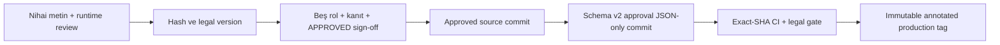

# Saydın Legal / Privacy Release Sign-off

**Durum:** BLOCKED
**Blokaj:** Zorunlu hukuk, altyapı, store ve yönetişim kanıtları tamamlanmadı.
**Teknik envanter tarihi:** 2026-08-19
**Kapsam:** iOS/Android istemci, API veri akışları, cihaz depolaması, Sentry,
paylaşım yüzeyi ve store beyanları

Bu belge hukuki görüş değildir. Amacı, istemci kodundan doğrulanabilen teknik
gerçeklerle hukuk/operasyon tarafından sağlanması gereken bilgileri ayırmak ve
eksik bilgiyle production yayını yapılmasını fail-closed engellemektir.

## 0. Onayın anlamı ve sınırı

`tool/verify_legal_release_approval.py` aşağıdakileri makinece doğrular:

- legal metinlerin, production runtime/privacy yüzeyinin, sürümün, tag'in ve
  approved source commit'in aynı approval artefaktına bağlı olduğunu;
- production approval commit'inin source commit'e göre yalnız
  `docs/legal/legal-release-approval.json` dosyasını değiştirdiğini;
- beş ayrı rol, benzersiz ad/kimlik, UTC zaman ve kalıcı kanıt URL/URN kaydı
  bulunduğunu;
- bu belgenin iki durum alanının tam `APPROVED` olduğunu, zorunlu açık iş
  kalmadığını ve onay tablosunda placeholder bulunmadığını;
- legal kaynaklarda bilinen taslak/yayın-engeli ifadelerinin kalmadığını.

Araç; yazılan kişinin gerçekten o kişi olduğunu, hukuken yetkili bulunduğunu,
kanıt bağlantısının içeriğini veya yapılan değerlendirmenin hukuken yeterli
olduğunu kriptografik olarak kanıtlayamaz. Production repository environment'ı
bağımsız required reviewer, self-review yasağı ve tag deployment policy ile
ayrıca korunmalıdır. Release sorumlusu diğer dört onay rolünden farklı bir kişi
olmalı; bu ayrım repository ayarlarında gerçek GitHub kimlikleriyle
uygulanmalıdır. Mevcut repository sahibi/yetkili kimlikleri dış girdi olduğu
için araç bunları uydurmaz.

## 1. İstemciden doğrulanan veri envanteri

Legal bundle'ın tek kaynak listesi `LEGAL_FILES` sabitidir:

- `lib/features/legal/data/sources/privacy_policy_tr.dart`
- `lib/features/legal/data/sources/privacy_policy_en.dart`
- `lib/features/legal/data/sources/kvkk_disclosure_tr.dart`
- `lib/features/legal/data/sources/kvkk_disclosure_en.dart`

| Veri / işlem | Toplama veya üretim | Hedef / saklama | Kod kanıtı | Doğrulanan sınır |
|---|---|---|---|---|
| Kalıcı UUID | Güncel legal bildirim yerel olarak kaydedildikten sonraki ilk API isteğinde üretilir; secure storage erişilemezse yalnız süreç ömrü boyunca kararlı ephemeral UUID kullanılır | iOS Keychain (`first_unlock_this_device`, sync kapalı), Android EncryptedSharedPreferences ve API | `lib/app.dart`, `lib/features/onboarding/presentation/cubit/onboarding_cubit.dart`, `lib/features/onboarding/presentation/pages/onboarding_page.dart`, `lib/features/config/presentation/widgets/config_readiness_gate.dart`, `lib/core/network/device_id_interceptor.dart`, `lib/core/storage/secure_storage_factory.dart` | Takma adlı/pseudonymous; anonim değildir. Config/API bildirimi pre-notice engellenir; Sentry ayrı satırdır |
| Cihaz/app header'ları | Platform, azaltılmış OS sürümü, app version/build ve dil | Her API isteği | `lib/core/network/device_info_interceptor.dart`, `lib/core/network/language_interceptor.dart` | iOS major.minor gönderir; Android sürüm değeri istemcide `unknown`dır. Backend log/saklama bilinmiyor |
| Hesaplama girdileri | Sembol(ler), tutar/tür, tarihler, dönem, enflasyon seçimi, portföy bileşenleri | Saydın API | `lib/features/what_if/data/repositories/what_if_repository_impl.dart`, `lib/features/comparison/data/repositories/comparison_repository_impl.dart`, `lib/features/dca/data/repositories/dca_repository_impl.dart`, `lib/features/portfolio/data/repositories/portfolio_repository_impl.dart` | Portföy için ayrı endpoint yoktur; her kalem `/v1/what-if/calculate` üzerinden hesaplanır. Backend log/saklama bilinmiyor |
| Kaydedilmiş senaryo | Hesaplama girdileri, ad/sembol, tür, `extraData`; sunucudan ID/zaman döner | Saydın API; POST/GET/DELETE | `lib/features/scenarios/data/repositories/scenarios_repository_impl.dart`, `lib/features/scenarios/data/models/saved_scenario_model.dart` | GET isteği `plan` query parametresi gönderir; sunucu saklama/yedek süresi bilinmiyor |
| Yerel tercihler ve legal bildirim kaydı | Tema, dil, favoriler, onboarding; legal bundle sürümü/hash'i, belge kimlikleri, locale, UTC gösterim zamanı ve `seen`/isteğe bağlı `acknowledged` kararı | SharedPreferences | `lib/features/settings/data/repositories/settings_repository_impl.dart`, `lib/features/favorites/data/repositories/favorites_repository_impl.dart`, `lib/features/onboarding/data/repositories/onboarding_repository_impl.dart` | `seen` kabul/rıza değildir. Hesap silme doğrulanırsa temizlenir; bunun dışında cihaz/OS depolama yaşam döngüsü geçerlidir |
| Hesap-silme cleanup marker'ı | Backend 200/204 doğrulandıktan sonra, destructive local wipe'tan önce oluşturulur | Application Support içinde `saydin_account_deletion_cleanup_pending_v1` | `lib/features/account/data/repositories/account_data_repository_impl.dart`, `lib/features/account/presentation/cubit/account_deletion_cubit.dart` | PII içermez; restart-safe faz kaydıdır. Cleanup tüm zorunlu adımlarla tamamlanana kadar kalır. iOS backup dışlama durumu ayrıca doğrulanmalıdır |
| Paylaşım görseli ve metni | Önizleme açıldığında dosya yazılmaz; kullanıcı **Paylaş** dediğinde What-if, Karşılaştırma, Portföy veya DCA sonucu PNG'ye çevrilir | Uygulamanın geçici cache dizini; Android'de ayrıca `share_plus` tarafından exact `cacheDir/share_plus/` altına aynı adlı kopya; ardından sistem share sheet'te kullanıcının seçtiği hedef | `lib/core/widgets/share_preview_sheet.dart`, `lib/core/utils/share_card_renderer.dart`, `lib/core/storage/share_card_cache.dart`, ilgili dört feature entry point | Kaynak PNG share sheet sonucu döndüğünde `finally` ile silinir. Startup, kaynak ve Android plugin kopyalarında 1 saatten eski dosyaları ve dizin başına 20 üstü LRU kalıntıları temizler; hesap silme exact canonical dizinlerdeki tüm eşleşen kopyaları fail-visible siler. Bir saatten genç son Android plugin kopyası sonraki startup retention pass'ine veya sonraki `share_plus` paylaşımına kadar kalabilir. Seçilen hedef ayrı alıcıdır; hedefin kendi kopyası uygulama kontrolünde değildir |
| Fotoğraflar'a ekleme | Kullanıcı sistem paylaşım seçeneklerinden Fotoğraflar'a kaydetmeyi seçerse iOS add-only izin istemi gösterebilir | Kullanıcının sistem Fotoğraflar kitaplığı; iCloud Fotoğraflar açıksa sonraki senkronizasyon kullanıcının Apple ayarlarına bağlıdır | `ios/Runner/Info.plist`, `ios/Runner/tr.lproj/InfoPlist.strings`, `ios/Runner/en.lproj/InfoPlist.strings` | `NSPhotoLibraryAddUsageDescription` yalnız ekleme amacını beyan eder; uygulama mevcut fotoğrafları okuma izni istemez. Sistem hedefi ve olası cloud sync cihaz/RC'de doğrulanmalıdır |
| Sentry telemetrisi | Store release workflow'u boş olmayan DSN zorunlu kılar; Sentry `runApp` ve legal bildirimden önce başlatılır, dolayısıyla başlangıç/legal kayıt hataları pre-notice gönderilebilir | Yapılandırılmış Sentry projesi | `lib/main.dart`, `.github/workflows/release.yml`, `lib/core/observability/sentry_pii_scrubber.dart`, `lib/core/observability/sentry_device_context.dart` | Screenshot/default PII/performance tracing/session replay/auto session tracking kapalıdır; Dart event ekleri de scrubber tarafından temizlenir. Dart event ve breadcrumb'ları scrubber'dan geçer; native crash envelope, region, retention, IP, processor ve gerçek serialized payload production-like RC'de ayrıca doğrulanmalıdır |
| Hesap/veri silme | `/v1/account` DELETE; yalnız 200/204 sonrasında durable marker ve local wipe | API + prefs/secure storage/share source cache/Android `share_plus` cache/in-memory session | `lib/features/account/presentation/cubit/account_deletion_cubit.dart`, `lib/features/account/data/repositories/account_data_repository_impl.dart`, `lib/core/storage/share_card_cache.dart` | 200/204 yoksa identity korunur. Share cache cleanup yalnız canonical root ve exact Android `share_plus` dizininde, symlink takip etmeden eşleşen PNG'leri siler; hata partial wipe olarak raporlanır. Partial local failure marker üzerinden backend'i tekrarlamadan retry edilir. Backend completion, lost-response ve yedek silme sözleşmesi doğrulanmadı |

### Platform backup gerçeği

Android `allowBackup="false"` kullanır; backup/data-extraction XML'leri ayrıca tüm
alanları exclude eder. iOS'ta Keychain kaydı `first_unlock_this_device` ve
`synchronizable: false` ile cihazlar arası senkronize edilmez. Buna karşılık
SharedPreferences ve Application Support içeriğinin OS-managed cihaz/iCloud
backup'ından dışlandığı bu repodan kanıtlanamıyor. Hukuk/ürün, iOS backup
dışlama davranışını ve cleanup marker'ının backup kapsamını yayın öncesi karara
bağlamalıdır.

### Bu repodan doğrulanamayan veri akışları

- API gateway, reverse proxy, CDN/WAF ve uygulama sunucusunun IP, user-agent,
  request body, device ID ve hata logları
- Veritabanı şeması, hesap/device ilişkilendirmesi, yedekler ve silme SLA'sı
- Hosting ve ağ sağlayıcılarının alt işleyenleri ile işleme ülkeleri
- Sentry production projesinin region, retention, IP collection, native crash
  envelope, subprocessor ve deletion ayarları
- Apple/Google developer hesabı ile store privacy/data-safety cevapları
- Backend veya store hesabı bu repository dışında olduğu için gerçek GDPR/AB
  storefront kapsamı ve Google Play account-deletion declaration sonucu

## 2. Yayın öncesi zorunlu karar ve kanıtlar

Bir madde tamamlandığında aynı satırda `Kanıt: https://...` veya
`Kanıt: urn:...` bulunmalıdır; araç kanıtın varlığını/biçimini kontrol eder,
içeriğini doğrulamaz. Uygulanamaz bir madde `- [x] N/A — <somut gerekçe> —
Owner: <rol> — Kanıt: <URL/URN>` biçiminde kapatılır. Gerekçesiz `N/A` kabul
edilmez. Açık zorunlu maddeler `- [ ]` kalır ve production gate'i bloke eder.

### Veri sorumlusu, başvuru ve yönetişim

- [ ] Veri sorumlusunun tam resmî/ticari unvanı, tebligata uygun açık adresi ve varsa temsilcisi
- [ ] KEP veya uygulanabilir resmî başvuru yöntemleri; `iletisim@saydin.app` sahipliği, erişim kontrolü, kimlik doğrulama ve 30 günlük cevap SLA'sı
- [ ] VERBİS yükümlülüğü/muafiyeti değerlendirmesi ve resmî kişisel veri işleme envanteri
- [ ] Saklama-imha politikası; aktif sistem, log ve yedek için kategori bazlı süre ve sorumlu
- [ ] Gerçek GitHub kimlikleriyle bağımsız production required reviewer, self-review yasağı ve tag deployment policy
- [ ] Tool, testler, workflow, bu belge, dört legal kaynak ve example JSON aynı approved source commit'te version control'e alınmış olmalı

### Kategori bazında işleme, alıcılar ve aktarım

- [ ] Her veri kategorisi için somut amaç, otomatik/yarı otomatik toplama yöntemi ve hukukça onaylı KVKK Madde 5 şartı; gerekiyorsa Madde 6 değerlendirmesi
- [ ] Veri kategorisi → alıcı grubu → aktarım amacı → aktif sistem → azami saklama → log/yedek imha matrisi
- [ ] API hosting, CDN/WAF, DNS/ağ, destek ve Sentry işleyenlerinin tam tüzel unvanları, ülkeleri, amaçları, alt işleyenleri ve retention bilgileri
- [ ] Bu işleyen adları/ülkeleri/amaçları TR ve EN nihai legal metinlerinde açıkça yer almalı
- [ ] Her yurt dışı akış için güncel KVKK Madde 9 mekanizması, DPA/standart sözleşme ve operasyon kanıtı

### Ürün, platform ve store kanıtları

- [x] İstemci 200/204 olmadan local wipe yapmaz; durable marker partial cleanup retry'ını backend DELETE'i tekrarlamadan sürdürür — Kanıt: urn:saydin:tests:account-deletion-state-machine
- [ ] Backend kabul/tamamlanma, timeout/lost-response, idempotency ve silme durum sorgusu contract/integration kanıtı
- [ ] İstemcide in-app `/v1/account/data-export` akışı yoktur; veri erişim/export kapsamı ve uygulanabilir kanal kararı
- [ ] Senaryo ve hesap silmenin aktif veri, log ve yedek katmanlarındaki sonucunu gösteren backend kanıtı
- [ ] Production-like RC serialized Sentry envelope testi: tutar, sembol, tarih, UUID, body/query, user/IP, native crash ve attachment canary'leri
- [ ] iOS uninstall/reinstall testinde Keychain UUID davranışı, ephemeral storage fallback'i ve yeni kurulum politikası
- [ ] iOS SharedPreferences/Application Support backup kapsamı ve gerekiyorsa backup exclusion uygulaması/testi
- [ ] Fotoğraflar add-only sistem hedefi için cihaz testi; gereksiz izin beyanı olmadığının doğrulanması
- [ ] Android gerçek cihazda source/plugin cache retention: hedef seçimi, dismiss, force-quit, bir saat eşiği, sonraki startup ve hesap silme sonrası dosya sistemi kanıtı
- [ ] iPad portrait/landscape/Split View gerçek cihaz smoke: CTA origin ile success/dismiss/error yollarında crash, hang ve yanlış popover konumu olmadığının kanıtı
- [ ] Gizlilik/KVKK metni ↔ App Store App Privacy ↔ Google Play Data Safety ↔ Google Play account-deletion declaration alan bazlı eşleştirmesi
- [ ] GDPR/AB storefront uygulanabilirlik kararı ve gerekiyorsa privacy notice/hak kanalları
- [ ] TR/EN nihai metin hukuk/DPO ve dil kontrolü; veri sorumlusu/işleyen/ülke/saklama bilgilerinin tamamlanması

### Legal sürüm ve teknik doğrulama

- [ ] Dört legal kaynakta bütün taslak/yayın-engeli ifadeleri kaldırılmış olmalı
- [ ] Nihai metin değişikliği sonrası `--print-bundle-hash` çalıştırılmalı; `LegalAcceptanceVersion.bundleSha256` aynı değere güncellenmeli
- [ ] Önceki production legal bundle değiştiyse `LegalAcceptanceVersion.current`, belge ID'leri ve metin tarihi artırılmalı; mevcut kullanıcıya yeniden gösterim testi geçmeli
- [ ] `--print-runtime-surface-hash` ile Dart runtime, privacy ARB'leri, platform bildirimleri ve bağımlılık yüzeyi kaydedilmeli
- [ ] Bu belgenin üst ve nihai durumu tam `APPROVED` olmalı; bütün checklist satırları kanıtlı `[x]`, onay tablosu eksiksiz olmalı

### Her production tag için zorunlu sıra

Legal onay tek bir tag ve tek bir approved source commit için geçerlidir. Legal
metin, runtime/privacy yüzeyi, işleyen, Sentry ayarı, store beyanı, ülke,
saklama/silme davranışı veya onay süreci değişirse §2 yeniden incelenir.

1. Dört legal kaynağı nihai hale getir; taslak/yayın-engeli metinlerini kaldır.
2. `python3 tool/verify_legal_release_approval.py --print-bundle-hash` çalıştır.
3. Hash'i `LegalAcceptanceVersion.bundleSha256` alanına yaz; gerekiyorsa
   `current`, document ID ve metin tarihlerini artır; testleri çalıştır.
4. `python3 tool/verify_legal_release_approval.py --print-runtime-surface-hash`
   çalıştır ve privacy/runtime review'ünü bu snapshot'a göre tamamla.
5. §2 kanıtlarını ve beş bağımsız rolü tamamla; üst/nihai durumu `APPROVED`
   yap. Planned production tag ve metin tarihi bu belgede yer alsın.
6. Kod, legal metin, tool/test/workflow ve bu belgeyi **source commit** olarak
   commit et; `APPROVED_SOURCE_SHA=$(git rev-parse HEAD)` değerini al.
7. Example JSON'dan schema v2 approval artefaktı oluştur. Tam source SHA, iki
   hash, tag, legal version, UTC zamanlar ve gerçek kimlik/kanıtlar kullan.
8. Verifier'ı production argümanlarıyla çalıştır. Source commit'ten sonra yalnız
   `docs/legal/legal-release-approval.json` ekleyen tek-parent'lı approval
   commit'i oluştur.
9. Approval commit CI'da yeşil olduktan sonra immutable annotated tag'i bu
   commit'e koy ve yalnız bu tag'i push et.

```bash
python3 tool/verify_legal_release_approval.py --print-bundle-hash
python3 tool/verify_legal_release_approval.py --print-runtime-surface-hash
python3 tool/verify_legal_release_approval.py \
  --approval docs/legal/legal-release-approval.json \
  --release-tag vX.Y.Z \
  --source-sha "$APPROVED_SOURCE_SHA"
```



### Approval JSON schema v2

JSON yetkili makine kaydıdır; bu belgedeki §3 insan-okur aynasıdır. Zorunlu
alanlar: `schema_version: 2`, `status: APPROVED`, `release_tag`, tam 40-hex
`source_commit_sha`, `legal_bundle_sha256`, `runtime_surface_sha256`, güncel
`legal_acceptance_version`, ISO-8601 UTC `approved_at` ve tam beş `approvals`
kaydıdır. Her rol kaydı benzersiz `role`, gerçek `name`, kurumsal/GitHub
`identity` (e-posta, `@handle` veya HTTPS profil), kalıcı `https` URL veya `urn`
`evidence` ve UTC `approved_at` taşır. `controller` nesnesindeki resmî unvan,
tebligat adresi ve resmî başvuru kanalı dört legal kaynağın her birinde birebir
yer almalıdır. Artefakt `approved_at` değeri en son rol onay zamanına eşit ve
onay zamanları release doğrulamasında 30 günden yeni olmalıdır.

Tam source SHA bu belgeye yazılmaz: belge source commit'in parçası olduğundan
bunu yapmak self-referential commit üretir. SHA, bir sonraki approval JSON-only
commit'inde yetkili kaynağa bağlanır ve workflow parent/diff kontrolü yapar.

### RC kanalı

`vX.Y.Z-rc.N` legal gate'i atlar; Android internal/draft ve iOS TestFlight'a
yüklenebilir. Bu, taslak metni hukuken onaylanmış yapmaz. RC erişimi yetkili ve
sınırlı tester grubuyla tutulmalı; external TestFlight review/tester dağıtımı
production approval yerine kullanılmamalıdır. RC'de gerçek kullanıcı verisi,
production DSN veya production backend kullanımı ayrıca risk sahibi tarafından
onaylanmalıdır.

## 3. Onay kaydı

| Rol | Ad / kimlik | Kanıt URL/URN | Tarih (UTC) | Sürüm | Durum |
|---|---|---|---|---|---|
| Ürün sahibi | BEKLENİYOR | — | — | — | BEKLEMEDE |
| Backend/altyapı sahibi | BEKLENİYOR | — | — | — | BEKLEMEDE |
| Güvenlik/Privacy Engineering | BEKLENİYOR | — | — | — | BEKLEMEDE |
| Hukuk/DPO | BEKLENİYOR | — | — | — | BEKLEMEDE |
| Release sorumlusu | BEKLENİYOR | — | — | — | BEKLEMEDE |

**Nihai durum:** BLOCKED
**Onaylanan uygulama sürümü:** —
**Onaylanan metin tarihi:** —

## 4. Kaynaklar

### Birincil kaynaklar

- KVKK Kurumu, [Aydınlatma Yükümlülüğü](https://www.kvkk.gov.tr/Icerik/2033/Aydinlatma-Yukumlulugu-):
  veri sorumlusu kimliği, amaç, alıcı/aktarım amacı, yöntem/hukuki sebep ve
  Madde 11 hakları aydınlatmanın asgari kapsamıdır.
- KVKK Kurumu,
  [Aydınlatma Yükümlülüğünün Yerine Getirilmesinde Uyulacak Usul ve Esaslar Hakkında Tebliğ](https://www.kvkk.gov.tr/Icerik/4132/aydinlatma-yukumlulugunun-yerine-getirilmesinde-uyulacak-usul-ve-esaslar-hakkinda-teblig):
  bilginin açık/sade olması, somut hukuki sebep, alıcı grubu ve ispat yükü.
- KVKK Kurumu,
  [Veri Sorumlusuna Başvuru Usul ve Esasları Hakkında Tebliğ](https://www.kvkk.gov.tr/Icerik/4109/Veri-Sorumlusuna-Basvuru-Usul-ve-Esaslari-Hakkinda-Teblig-Resmi-Gazetede-yayinlanmistir):
  yazılı, KEP, güvenli/mobil imza, kayıtlı e-posta ve amaç için geliştirilmiş
  uygulama üzerinden başvuru yöntemleri.
- KVKK Kurumu,
  [Kişisel Verilerin Yurt Dışına Aktarılması Rehberi](https://www.kvkk.gov.tr/Icerik/8142/Kisisel-Verilerin-Yurt-Disina-Aktarilmasi-Rehberi):
  güncel Madde 9 değerlendirmesi ve uygun güvence mekanizmaları.
- KVKK Kurumu,
  [Anonim hale getirme tanımı](https://www.kvkk.gov.tr/SharedFolderServer/CMSFiles/a9eb73e7-bf35-46d7-84e7-58a4618128cc.pdf):
  başka verilerle eşleştirilse dahi belirlenebilir kişiyle ilişkilendirilemeyen
  veri; kalıcı device UUID bu eşiği kanıtlamaz.
- Apple Developer Documentation,
  [NSPhotoLibraryAddUsageDescription](https://developer.apple.com/documentation/bundleresources/information-property-list/nsphotolibraryaddusagedescription):
  fotoğraf kitaplığına yalnız ekleme yapan erişimin amaç metni.
- Apple Developer Documentation,
  [Keychain öğelerini silme](https://developer.apple.com/documentation/security/updating-and-deleting-keychain-items):
  kontrollü silme `SecItemDelete` ile yapılır; secure storage `deleteAll()` bunu
  hesap silmenin local cleanup aşamasında çağırır.

### İkincil / operasyonel not

- Apple Developer Forums,
  [iOS uninstall sonrası Keychain davranışı](https://developer.apple.com/forums/thread/36442):
  forum yanıtı operasyonel test girdisidir, birincil politika kaynağı değildir;
  uninstall davranışı uygulama tarafından silme garantisi olarak sunulmaz.

## 5. Revizyon ve kapsam dışı alanlar

| Tarih | Revizyon | Değişiklik | Durum |
|---|---|---|---|
| 2026-08-18 | 1 | İstemci envanteri, fail-closed legal gate ve dış hukuk girdileri | BLOCKED |
| 2026-08-18 | 2 | Runtime/privacy hash, approval schema v2, Sentry/pre-notice, paylaşım/Photos, marker/backup ve production sıra sertleştirmesi | BLOCKED |
| 2026-08-19 | 3 | Android `share_plus` nested cache retention/account-wipe ve iPad popover origin teknik sözleşmesi | BLOCKED |

Kapsam dışı: backend kaynak kodu/veritabanı, production cloud ve Sentry console
ayarları, Apple/Google hesap beyanları, şirketin resmî sicil/VERBİS kayıtları,
sözleşmeler ve gerçek approver yetkileri. Bunlar bu belgedeki kanıt satırlarıyla
dış sistemlerden sağlanmadan production onayı verilemez.
